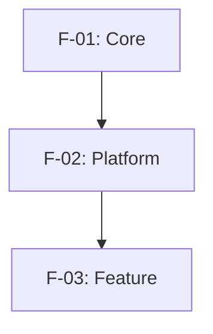
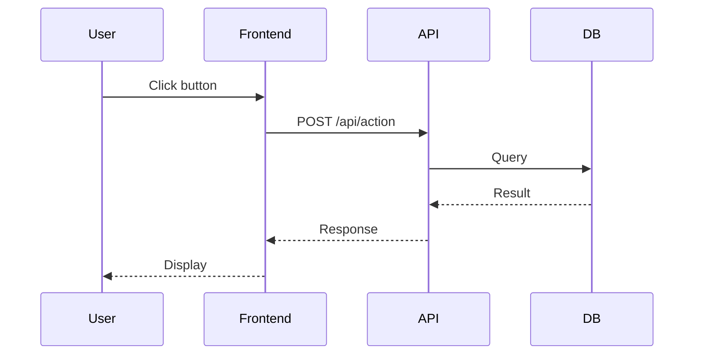
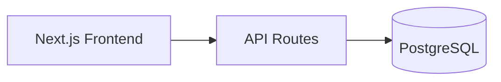

# SDD Quick Reference Card

**Spec-Driven Development** - One-Page Cheat Sheet

---

## 🎯 Core Principles (The 8 Commandments)

1. **Modular Over Monolithic** → Break specs into focused files (<10 min read each)
2. **Layered Architecture** → Architecture (S-00) → System (S-XX) → Features (F-XX)
3. **Explicit Dependencies** → Every file declares what it needs upfront
4. **Template-Driven** → All files of same type use identical structure
5. **Testing Integrated** → Tests live with features, not separate docs
6. **Source Traceability** → Always cite original requirements
7. **Progressive Disclosure** → README → Quick Ref → Full Spec
8. **Visual-First** → Use Mermaid diagrams for complex concepts

---

## 📁 Directory Structure

```
project-root/
├── README.md                    # Project overview
└── specs/
    ├── README.md                # Navigation guide (start here)
    ├── system/                  # Cross-cutting design
    │   ├── S-00-architecture.md # Foundation (always exists)
    │   ├── S-01-*.md            # Core modules (numbered by dependency)
    │   └── S-XX-*.md
    ├── features/                # Individual features
    │   ├── TEMPLATE.md          # Template for new features
    │   ├── F-01-*.md            # Core infrastructure
    │   └── F-XX-*.md            # Numbered by implementation order
    └── archive/                 # (Optional) Original docs
```

---

## 🔢 Numbering Convention

### System Modules (S-XX)

**Mandatory Foundation (ALL Projects):**
- **⚠️ S-00**: Architecture Overview (✅ REQUIRED - ALWAYS first)
- **⚠️ S-01**: UI/UX Design System (✅ REQUIRED - file: `S-01-uiux-design.md`)
  - Content varies: Web/Mobile UI, CLI terminal design, Component tokens, or "No UI" placeholder
- **⚠️ S-02**: Testing Strategy (✅ REQUIRED - quality gates for all features)

**Project-Specific (S-03+):**
- **S-03+**: Numbered by dependency order
- Examples: S-03 Database → S-04 Auth (uses DB) → S-05 API (uses Auth)

### Features (F-XX)
- **F-01**: Core Infrastructure (database + auth, no dependencies)
- **F-02+**: Numbered by implementation order
- Lower numbers = foundational, higher = build on earlier

---

## 📝 When to Use System vs Feature

| Use **System (S-XX)** when... | Use **Feature (F-XX)** when... |
|-------------------------------|-------------------------------|
| Describes HOW the system works | Describes WHAT users experience |
| Used by multiple features | Single user-facing functionality |
| Technical pattern/architecture | Has UI screens or user flows |
| No user stories | Has acceptance criteria |
| Examples: UI/UX Design, Database schema, API architecture, Testing strategy | Examples: User login, Dashboard, Task management |

---

## 📋 File Templates at a Glance

### System Design File (S-XX)

```markdown
# S-XX: [Module Name]

## Quick Reference
Purpose, Dependencies, Used By

## Dependencies
Required modules, external services

## Architecture Overview
Description + Mermaid diagram

## Technical Implementation
Schemas, APIs, patterns, code examples

## Related Documents
Links to S-XX and F-XX files

## Notes
Future enhancements, limitations
```

### Feature File (F-XX)

```markdown
# F-XX: [Feature Name]

## Quick Reference
What, Why, Dependencies, Used By, Status checkboxes

## Dependencies
Features, system modules, external services

## PRD: Product Requirements
Overview, User Flow, UI Components, Business Rules, Acceptance Criteria

## Technical Implementation
API Endpoints, Database Schema, Frontend Components, Prompts (if AI)

## Tests
Tier 1 (critical path), E2E, Integration, Unit

## Notes
Future enhancements, limitations
```

---

## 🔗 Dependency Management

### Rules
1. No circular dependencies (must be DAG)
2. All dependencies must exist
3. Declare in this order: F-XX, S-XX, External

### Example
```markdown
## Dependencies

### Required Features
- F-01: Database & Auth - Provides user authentication

### Required System Modules
- S-03: API Architecture - Defines REST patterns

### External Services
- Stripe API - Payment processing
```

---

## 📊 Implementation Waves

Group features by dependency depth:

```
Wave 1: F-01 (no dependencies)
Wave 2: F-02, F-03 (depend only on Wave 1)
Wave 3: F-04, F-05, F-06 (depend on Wave 1 or 2)
Wave 4: ... (depend on Wave 1-3)
```

**Implementation Strategy**: Complete all features in Wave N before starting Wave N+1

---

## ✅ Priority Levels

- **CRITICAL**: Must-have for MVP, blocks other features
- **HIGH**: Important for good UX
- **MEDIUM**: Enhances usability
- **LOW**: Nice-to-have (mark as V1.5, V2.0)

---

## 📈 Mermaid Diagram Patterns

### Dependency Graph


### User Flow (Sequence)


### System Architecture (C4)


---

## 🧪 Testing Pyramid

```
     /\
    /E2E\         ← Few (critical paths only)
   /------\
  /  Intg  \      ← Some (API + DB)
 /----------\
/    Unit    \    ← Many (components, utils)
```

**Tier 1 Tests**: Critical paths that BLOCK deployment if they fail

---

## 📖 Reading Order for Developers

1. **Architecture** → [S-00-architecture.md](system/S-00-architecture.md)
2. **System Design** → [S-01, S-02, ...] in order
3. **Features** → Start with F-01, follow waves
4. **Template** → Use [TEMPLATE.md](features/TEMPLATE.md) for new features

---

## 🚀 Quick Start Workflow

### Step 1: Understand the Project
Read `specs/README.md` → Feature Index → Dependency Graph

### Step 2: Choose a Feature
Pick from implementation waves (start with Wave 1)

### Step 3: Read Dependencies
Review all F-XX and S-XX files listed in Dependencies section

### Step 4: Implement
Follow Technical Implementation section, write tests as defined

### Step 5: Update Status
Check off implementation status checkboxes in the spec file

---

## 🔍 Quality Checklist (Quick)

- [ ] All files follow naming convention (S-XX-*.md, F-XX-*.md)
- [ ] Every file has Dependencies section
- [ ] No circular dependencies
- [ ] Feature Index table in specs/README.md is complete
- [ ] Dependency graph is valid Mermaid
- [ ] All CRITICAL features have Tier 1 tests

---

## 🛠️ Common Commands

### Find a Feature
```bash
ls specs/features/F-*
```

### Check Dependencies
```bash
grep "^- F-" specs/features/F-05-*.md
```

### Validate Mermaid
Paste diagram into https://mermaid.live

---

## 💡 Pro Tips

1. **Start Small**: Begin with S-00, S-01, F-01
2. **Keep It DRY**: Reference other specs instead of duplicating
3. **Update as You Go**: Specs are living documents
4. **Mermaid Everything**: Complex concepts → diagrams
5. **Test Early**: Write Tier 1 tests before implementation

---

## 📞 Need More Detail?

- **Full Prompt**: [SDD-TEMPLATE-PROMPT.md](./SDD-TEMPLATE-PROMPT.md)
- **Workflow Example**: [SDD-WORKFLOW-EXAMPLE.md](./SDD-WORKFLOW-EXAMPLE.md)
- **Templates**: [templates/](./templates/)

---

**Quick Decision Tree**

```
Need to add documentation?
├─ Is it used by 2+ features? → System Module (S-XX)
├─ Is it a user-facing feature? → Feature Spec (F-XX)
├─ Is it project overview? → README.md
└─ Is it internal note? → Add to Notes section of related file
```

---

**Version**: 1.0 | **Last Updated**: 2025-11-27
