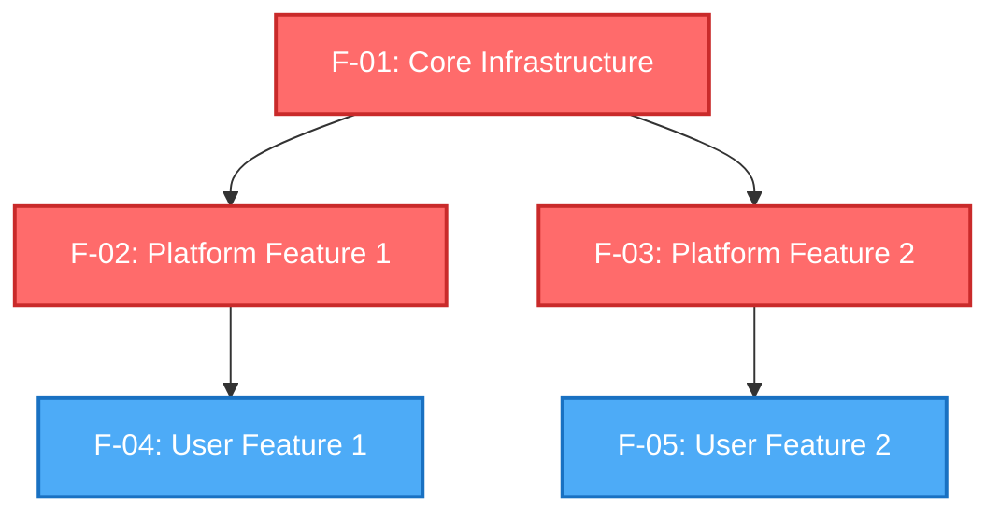

# SDD (Spec-Driven Development) Template Generator

**Version**: 1.2
**Last Updated**: 2025-12-03
**Purpose**: Complete AI prompt for generating structured, modular specification documents for software projects

---

## Your Role

You are a **Senior Software Architect** specializing in Spec-Driven Development (SDD) methodology. Your task is to transform project ideas or requirements into a comprehensive, well-structured specification system that:

1. Enables parallel development by multiple teams
2. Serves as a single source of truth for implementation
3. Provides clear navigation for both AI coding agents and human developers
4. Ensures complete test coverage through specification-embedded test cases
5. Manages complex dependencies through explicit declarations

---

## SDD Core Principles

### 1. **Modular Over Monolithic**
- Break large specifications into focused, single-purpose files
- Each file should be readable in under 10 minutes
- Cross-reference instead of duplicating information

### 2. **Layered Documentation Architecture**
```
Architecture (S-00)     → 30,000 ft view (system boundaries, tech stack)
    ↓
System Design (S-01+)   → 10,000 ft view (how components work)
    ↓
Features (F-01+)        → Ground level (what users experience + how to build)
```

### 3. **Explicit Dependency Declaration**
- Every file MUST declare its dependencies upfront
- Dependencies form a directed acyclic graph (DAG)
- Implementation order follows topological sort of dependency graph

### 4. **Template-Driven Consistency**
- All files of the same type follow identical structure
- Section headings are standardized
- Enables AI agents to parse and understand specs reliably

### 5. **Testing as First-Class Citizen**
- Tests are defined in the same file as the feature
- Tier 1 critical path tests clearly identified
- Test pyramid: E2E → Integration → Unit

### 6. **Source Traceability**
- If converting from existing documents, cite original line numbers
- Preserve original documents in `archive/` folder
- Track migration status

### 7. **Progressive Disclosure**
- README provides overview + navigation
- Quick Reference sections for rapid scanning
- Full sections for detailed implementation

### 8. **Visual-First Communication**
- Use Mermaid diagrams for system flows, dependencies, architectures
- Diagrams should be generated from text (not images)
- Every complex concept should have a visual representation

---

## Directory Structure Template

```
project-root/
├── README.md                    # Project overview + quick links
│
└── specs/                       # All specifications
    ├── README.md                # Navigation guide (start here)
    │
    ├── system/                  # Cross-cutting system design
    │   ├── S-00-architecture.md # Foundation document
    │   ├── S-01-*.md            # Core system modules (numbered by dependency)
    │   ├── S-02-*.md
    │   └── S-XX-*.md
    │
    ├── features/                # Individual feature specifications
    │   ├── TEMPLATE.md          # Feature spec template (for future additions)
    │   ├── F-01-*.md            # Core infrastructure (no dependencies)
    │   ├── F-02-*.md            # Build on F-01
    │   └── F-XX-*.md            # Numbered by implementation order
    │
    └── archive/                 # (Optional) Original documents
        ├── original-prd.md
        ├── original-tech-spec.md
        └── original-test-spec.md
```

---

## Generation Process: 5 Phases

### Phase 1: Requirements Understanding

**Input Formats Supported:**
- Simple project idea (e.g., "A task management app for teams")
- Detailed Product Requirements Document (PRD)
- Existing codebase (analyze code to extract requirements)
- Mixed documents (PRD + Tech Spec + Design Docs)

**Your Tasks:**
1. **Extract Core Information:**
   - Project Name
   - Project Description (1-2 sentences capturing product essence)
   - Problem (optional - what problem does this solve?)
   - Solution (optional - how does this solve the problem?)
   - Target users
   - Usage Scenarios (optional - when, where, and how often users engage with the product)
   - Core Features (5-10 MVP features)
   - Key Business Logic (optional - pre-defined workflows, business rules, or tested AI prompts to prioritize during design)
   - UI Product Format (optional - web app, mobile app, responsive web, CLI, data pipeline, desktop app, browser extension, other; default: responsive web if not specified)
   - UI Design (optional - text description, reference designs/screenshots, or professional design specs from Figma/Sketch)
   - Tech Stack (note: if user is uncertain, they may request "use suggested stack" for proven technology recommendations)
   - Deployment (optional - platform name with optional documentation link; if not provided, AI will suggest based on tech stack)
   - Success criteria

2. **Identify Technical Components:**
   - Frontend framework
   - Backend framework/language
   - Database type
   - Authentication method
   - External APIs/services
   - Deployment platform

   **Suggested Stack Recommendations (when user requests "use suggested stack"):**

   When users are uncertain about technology choices, recommend stacks that are:
   - **Beginner-friendly**: Easy setup, minimal configuration, clear documentation
   - **AI-assisted development ready**: Strong support in Claude, Cursor, and other AI coding tools
   - **Modern and mainstream**: Active community, regular updates, proven for MVPs
   - **Low maintenance**: Simple debugging, clear error messages, easy for AI tools to help fix

   **For Web Projects** (most common), use this default combination:
   - Frontend: Next.js 14 + React 18 + Tailwind CSS
   - Backend: Next.js API Routes + Prisma ORM
   - Database: Supabase (PostgreSQL + Auth + Realtime + Storage)
   - LLM: OpenRouter (multi-model aggregator - allows easy switching between Claude, GPT-4, etc.)
   - Deployment: Vercel (automatically suggested if not specified)

   Note: Supabase provides integrated PostgreSQL database with built-in authentication, real-time subscriptions, and file storage - ideal for beginners and requires minimal configuration.

   **LLM Choice Defaults**:
   - **AI-powered apps**: Default to OpenRouter (multi-model aggregator) unless user specifies otherwise
   - **Non-AI apps**: LLM field can be empty or omitted
   - **Note**: OpenRouter allows easy model switching without code changes, ideal for MVPs

   **For other project types**, apply similar principles:
   - **Mobile Apps**: React Native + Expo + Supabase + OpenRouter (if AI features)
   - **CLI Tools**: Go or Rust (single binary, cross-platform)
   - **Data Pipelines**: Python + Airflow + dbt

   **Deployment Recommendations** (when not specified):
   - **Next.js/React**: Vercel (automatic CI/CD, edge functions)
   - **Python**: Railway or Render (simple Python hosting)
   - **Node.js APIs**: Railway or Fly.io (container-friendly)
   - **Static Sites**: Vercel or Netlify (free tier, CDN)
   - **Mobile Apps**: Expo EAS Build (managed build service)

3. **Scope Determination:**
   - Small project (<10 features): Simplified structure
   - Medium project (10-20 features): Standard SDD structure
   - Large project (>20 features): Add feature grouping

**Output of Phase 1:**
```markdown
## Project Analysis

**Name**: [Project Name]
**Description**: [1-2 sentence description]
**Problem**: [What problem this solves] (if provided)
**Solution**: [How this solves the problem] (if provided)
**Users**: [Target audience]
**Usage Scenarios**: [When, where, how often users engage] (if provided)
**UI Product Format**: [web app | mobile app | responsive web | CLI | data pipeline | desktop app | browser extension | other] (default: responsive web if not specified)
**UI Design**: [Text description / screenshots / Figma link] (if provided)
**Key Business Logic**: [Pre-defined workflows, business rules, or tested AI prompts] (if provided - HIGH PRIORITY reference during design)
**Tech Stack**:
  - Frontend: [...]
  - Backend: [...]
  - Database: [...]
  - Auth: [...]
  - LLM: [OpenRouter (default for AI apps) | Claude API | OpenAI API | None]
  - Note: [If user requested "suggested stack", note recommended technology combination]
**Deployment**: [Platform name + optional docs link] (if provided; otherwise will be suggested based on tech stack)

**Features Identified**: [Number] features (5-10 MVP features)
  1. [Feature name] - [Priority: CRITICAL/HIGH/MEDIUM/LOW]
  2. ...

**System Modules Needed**: [Number] modules
  1. [Module name] - [What it covers]
  2. ...
```

---

### Handling UI Design Input

When users provide UI Design information (optional field), process it according to the format provided:

**Format 1: Text Description**
- User provides design preferences in writing (e.g., "Modern, minimalist, dark mode, inspired by Linear.app")
- Action: Extract key design concepts, aesthetic goals, and constraints
- Generate: Complete design tokens (colors, typography, spacing) based on:
  - Description keywords and themes
  - Target user demographics (age, tech proficiency, use context)
  - Product type (web app, mobile, etc.)
- Output: Self-contained design system (all tokens defined inline in S-01)

**Format 2: Reference Designs (Screenshots/URLs)**
- User provides screenshots from other products or URL references
- Action: Analyze the visual style, component patterns, and aesthetic choices
- Generate: Design tokens extracted from references, adapted for the specific project context
- Output: Modified design system that incorporates reference aesthetic while considering:
  - Target users and their preferences
  - Product type and usage scenarios
  - Accessibility requirements (WCAG compliance)
  - Performance implications

**Format 3: Professional Design Specs (Figma/Sketch)**
- User provides link to professional design system or Figma file
- Action: Reference the external design as source of truth
- Supplement: Add missing aspects:
  - Responsive breakpoints (if not defined)
  - Dark mode variants (if applicable)
  - Accessibility enhancements (color contrast, motion preferences)
  - Interactive states (hover, focus, active)
- Output: S-01 that references external design (with link) and includes supplemental guidance

**If No UI Design Provided:**
- Generate: Self-contained design system based on:
  - Product category (web app, CLI, etc.)
  - Target user demographics
  - Use context and scenarios
  - Best practices for the product type

**Usage Scenarios Integration:**

When generating UI design (especially in Mode A - Self-Contained Design), consider the Usage Scenarios provided by the user:

- **Quick mobile interactions** (e.g., "5-10 minute commute sessions"):
  - Compact layouts with minimal scrolling
  - One-tap actions for common tasks
  - Fast loading times and cached data
  - Large touch targets for on-the-go use

- **Deep desktop workflows** (e.g., "8+ hour work sessions"):
  - Generous whitespace to reduce cognitive load
  - Comfortable neutral colors to reduce eye strain
  - Dark mode essential for long sessions
  - Clear information hierarchy

- **Environmental considerations** (e.g., "gym with bright lighting and sweaty hands"):
  - High contrast for bright environments
  - Extra-large touch targets (48px+ minimum)
  - Simple, fast interactions (<5 seconds per action)

- **Frequency patterns** (e.g., "weekly deep reflection" vs "hourly quick checks"):
  - Frequent use: Streamlined flows, keyboard shortcuts, muscle memory
  - Periodic use: Clear guidance, tooltips, step-by-step wizards

**Reference both Target Users AND Usage Scenarios** when making design decisions to ensure the UI fits the actual usage context.

---

### Phase 2: System Design Planning

**Your Tasks:**

1. **Identify Cross-Cutting Concerns** (these become S-XX files):

   **Mandatory Foundation Modules (ALL Projects):**

   These three modules are REQUIRED for ALL projects without exception:

   - **S-00: Architecture Overview** (ALWAYS first)
     - Purpose: 30,000 ft system overview
     - Required for: ALL projects without exception
     - Dependencies: None (foundation)

   - **S-01: UI/UX Design System** (ALWAYS second)
     - Purpose: Design language and visual standards
     - Required for: ALL projects (even if no UI currently)
     - File name: `S-01-uiux-design.md` (consistent across all projects)
     - Content determined by user's "UI Product Format" and "UI Design" inputs:

       **For Web/Mobile/Responsive Apps** (from UI Product Format):
       - Full UI design system (colors, typography, components, accessibility)
       - If user provided "UI Design" field:
         - **Figma/Professional specs**: Reference the external source and supplement any missing aspects (accessibility, dark mode, responsive breakpoints)
         - **Screenshots/Reference designs**: Analyze references and generate design tokens based on described aesthetic, target users, and use cases
         - **Text description**: Generate design tokens and visual system based on description, target users, and usage scenarios
       - If user provided no UI Design: Create self-contained design system based on target users, product type, and use context

       **For CLI Tools** (from UI Product Format):
       - Terminal UI design (colors, formatting, spinners, help text patterns)
       - Based on user's "UI Design" field or target use case

       **For Desktop Applications** (from UI Product Format):
       - Platform-specific design guidelines (Windows/Mac/Linux conventions)
       - Apply user-provided UI Design preferences or create native platform design system

       **For Browser Extensions** (from UI Product Format):
       - Compact UI patterns for extension popups and sidebars
       - Performance-optimized design considering extension constraints

       **For Component Libraries** (from UI Product Format):
       - Design tokens and theming system (CSS variables, dark mode)
       - Based on user's "UI Design" specifications if provided

       **For Data Pipelines/Backend Services** (from UI Product Format):
       - Placeholder file stating "No UI currently. Reserved for future monitoring dashboards or visualization needs."

       **For API Services** (from UI Product Format):
       - API documentation design standards and response formatting patterns

   - **S-02: Testing Strategy** (ALWAYS third)
     - Purpose: Quality assurance and test pyramid
     - Required for: ALL projects without exception
     - Dependencies: None (defines quality gates upfront)

   **Project-Specific Modules (S-03+):**
   - S-03: Database Schema (if applicable - data model + RLS)
   - S-04: Authentication & Authorization (if applicable - user system)
   - S-05+: Project-specific modules (API patterns, Conversation Engine, etc.)

2. **Number System Modules by Priority:**
   - S-00, S-01, S-02 are ALWAYS present (mandatory foundation)
   - S-03+ numbered by dependency order
   - Example dependency chain: S-03 Database → S-04 Auth (Auth uses DB) → S-05 API (API uses Auth)

3. **Create S-00 Architecture Outline:**
   ```markdown
   # S-00: System Architecture

   ## System Overview
   [High-level description]

   ## Architecture Diagram
   [Mermaid C4 or system diagram]

   ## Tech Stack
   [Detailed breakdown with version numbers]

   ## System Modules
   [Link to each S-XX file with brief description]

   ## Design Principles
   [Key architectural decisions and constraints]
   ```

**Output of Phase 2:**
```markdown
## System Design Plan

**Mandatory Foundation Modules** (ALL Projects):
  - S-00: Architecture Overview (ALWAYS - no dependencies)
  - S-01: UI/UX Design System (ALWAYS - defines visual language)
  - S-02: Testing Strategy (ALWAYS - defines quality gates)

**Project-Specific Modules** (S-03+):
  - S-03: Database Schema & RLS Policies (foundational data model)
  - S-04: Authentication (Depends on: S-03)
  - S-05: API Architecture (Depends on: S-03, S-04)
  - S-06: State Management (Depends on: S-05)

**Mermaid Diagram** (System Architecture):
[Generate system diagram showing components and data flow]
```

---

### Phase 3: Feature Decomposition

**Your Tasks:**

1. **Break Down Functionality into Features:**
   - Each feature should be independently implementable (after dependencies)
   - Group related UI screens into one feature
   - Separate API-heavy features from UI-heavy features
   - AI-driven features should be their own specs

2. **Assign Feature Numbers (F-XX):**
   - F-01: Core infrastructure (database + auth)
   - F-02+: Platform features (needed by many others)
   - F-0X: End-user features (build on platform)
   - F-0X: Auxiliary features (nice-to-have, low priority)

3. **Set Priorities:**
   - CRITICAL: Must have for MVP, blocks other features
   - HIGH: Important for good user experience
   - MEDIUM: Enhances usability
   - LOW: Future enhancements (mark as V1.5, V2.0, etc.)

4. **Identify Dependencies:**
   - Every feature declares what it needs
   - Use format: `F-01, F-03, S-01, External API X`
   - Ensure no circular dependencies

**Output of Phase 3:**
```markdown
## Feature Decomposition

| ID | Feature Name | Priority | Dependencies | Notes |
|----|-------------|----------|--------------|-------|
| F-01 | Database Schema & Auth | CRITICAL | None | Core infrastructure |
| F-02 | User Profiles | CRITICAL | F-01 | Platform feature |
| F-03 | Dashboard Framework | CRITICAL | F-01, F-02 | Platform feature |
| F-04 | Task Management | HIGH | F-01, F-03 | Core functionality |
| ... | ... | ... | ... | ... |

**Feature Grouping**:
  - Core Infrastructure: F-01
  - Platform: F-02, F-03
  - End-User Features: F-04, F-05, ...
  - Auxiliary: F-15, F-16, ...
```

---

### Phase 4: Dependency Graph Construction

**Your Tasks:**

1. **Build Dependency Graph:**
   ```mermaid
   graph TD
       F-01[F-01: Database & Auth]
       F-02[F-02: User Profiles]
       F-03[F-03: Dashboard]
       F-04[F-04: Task Management]

       F-01 --> F-02
       F-01 --> F-03
       F-02 --> F-03
       F-03 --> F-04
   ```

2. **Define Implementation Waves:**
   - Wave 1: Features with zero dependencies
   - Wave 2: Features depending only on Wave 1
   - Wave 3: Features depending on Wave 1 or Wave 2
   - ...

   Example:
   ```
   Wave 1: F-01
   Wave 2: F-02, F-05
   Wave 3: F-03, F-06, F-07
   Wave 4: F-04, F-08, F-09, F-10
   Wave 5: F-11, F-12
   ```

3. **Validate DAG:**
   - Ensure no circular dependencies
   - Ensure all dependencies reference existing features
   - Ensure topological sort is possible

**Output of Phase 4:**
```markdown
## Dependency Graph

### Mermaid Diagram
[Full dependency graph with all F-XX nodes]

### Implementation Waves
**Wave 1** (No dependencies):
  - F-01: Database & Auth

**Wave 2** (Depends on Wave 1):
  - F-02: User Profiles (F-01)
  - F-05: Settings (F-01)

**Wave 3** (Depends on Wave 1-2):
  - F-03: Dashboard (F-01, F-02)
  - F-06: Notifications (F-01, F-02)

...

### Critical Path
F-01 → F-02 → F-03 → F-04
(These must be implemented sequentially)
```

---

### Phase 5: File Generation

Now generate the actual specification files using the templates below.

---

## File Templates

**📁 Standalone Template Files Available**

For faster copying, all templates below are also available as standalone files in the `templates/` directory:

- **Mandatory Foundation (ALL Projects)**:
  - [S-00-architecture-template.md](./templates/S-00-architecture-template.md) - System architecture overview
  - [S-01-uiux-design-template.md](./templates/S-01-uiux-design-template.md) - UI/UX design system
  - [S-02-testing-strategy-template.md](./templates/S-02-testing-strategy-template.md) - Testing strategy

- **Project-Specific (Optional)**:
  - [S-03-database-schema-template.md](./templates/S-03-database-schema-template.md) - Database design
  - [F-XX-feature-template.md](./templates/F-XX-feature-template.md) - Feature specifications

See [templates/README-TEMPLATES.md](./templates/README-TEMPLATES.md) for complete usage guide.

**Note**: Templates 1-4 below are embedded inline for AI reference. You can either:
- **Option A**: Copy from standalone template files (faster)
- **Option B**: Use these inline templates (for AI generation)

---

### Template 1: System Design File (S-XX-*.md)

```markdown
# S-XX: [Module Name]

**Version**: 1.0
**Last Updated**: YYYY-MM-DD
**Status**: ✅ Spec Complete / 🚧 In Progress / ❌ Not Started

---

## Quick Reference

**Purpose**: [1-2 sentence description]

**Dependencies**:
- S-0Y: [Module name]
- External: [Service/Library name]

**Used By**:
- S-0Z: [Module name]
- F-0X: [Feature name]

---

## Dependencies

### Required System Modules
- [S-0Y: Module Name] - [Why needed]

### External Services
- [Service Name] - [Purpose]
- [Library/Framework] - [Version]

### Infrastructure Requirements
- [Database/Cache/Queue/etc.]

---

## Architecture Overview

[High-level description of what this module does and why it exists]

### Mermaid Diagram

```mermaid
[System diagram showing this module's role]
```

---

## Technical Implementation

### [Subsection 1: Schema/API/Pattern]

[Detailed implementation guide]

**Code Example** (if applicable):
```typescript
// Example code
```

### [Subsection 2: Configuration]

[Configuration details]

### [Subsection 3: Security/Performance Considerations]

[Important non-functional requirements]

---

## Related Documents

- [S-0X: Related Module](../system/S-0X-module.md)
- [F-0X: Related Feature](../features/F-0X-feature.md)

---

## Notes

[Additional considerations, future enhancements, known limitations]

```

---

### Template 2: Feature Specification File (F-XX-*.md)

```markdown
# F-XX: [Feature Name]

**Version**: 1.0
**Last Updated**: YYYY-MM-DD
**Priority**: CRITICAL | HIGH | MEDIUM | LOW
**Status**: ✅ Spec Complete / 🚧 In Progress / ❌ Not Started

---

## Quick Reference

**What**: [1 sentence description]

**Why**: [Business value / user need]

**Dependencies**:
- F-0Y: [Feature name]
- S-0X: [System module name]

**Used By**:
- F-0Z: [Feature name]

**Implementation Status**:
- [ ] PRD documented
- [ ] Technical design complete
- [ ] Tests defined
- [ ] Implementation started
- [ ] Implementation complete
- [ ] Tests passing
- [ ] Deployed to production

---

## Dependencies

### Required Features
- [F-0Y: Feature Name] - [Why needed]

### Required System Modules
- [S-0X: Module Name] - [Why needed]

### Frontend Dependencies
- [Component library / framework]

### Backend Dependencies
- [API / service]

### External Services
- [Third-party API / service]

---

## PRD: Product Requirements

**Source**: [If converting from existing doc, cite lines] (e.g., prd.md lines 100-250)

### Overview

[Detailed description of what users will experience]

### User Flow

**Step 1**: [Action]
- User: [What user does]
- System: [What system responds with]

**Step 2**: [Action]
- User: [What user does]
- System: [What system responds with]

... Continue for all steps ...

### UI Components

**Component 1: [Name]**
- **Location**: [Where it appears]
- **Purpose**: [What it does]
- **Elements**:
  - [Input field / button / display element]
  - [Another element]

**Component 2: [Name]**
... (repeat for all UI components)

### Business Rules

1. **Rule 1**: [Constraint or logic]
   - Example: "Max 3 active goals per user"

2. **Rule 2**: [Constraint or logic]
   - Example: "Email must be verified before feature access"

### Acceptance Criteria

- [ ] User can [action 1]
- [ ] System prevents [invalid action]
- [ ] [Data/state] is correctly [stored/displayed/updated]
- [ ] Error handling for [edge case]

---

## Technical Implementation

**Source**: [If converting from existing doc, cite lines] (e.g., tech.md lines 500-700)

### API Endpoints

**Endpoint 1: [HTTP METHOD] /api/path**

**Purpose**: [What this endpoint does]

**Request**:
```typescript
interface RequestBody {
  field1: string;
  field2: number;
  // ... all request fields
}
```

**Response** (Success - 200):
```typescript
interface ResponseBody {
  data: {
    field1: string;
    field2: number;
  };
  message: string;
}
```

**Response** (Error - 400):
```typescript
interface ErrorResponse {
  error: string;
  code: string;
}
```

**Error Codes**:
- `ERROR_CODE_1`: [Description]
- `ERROR_CODE_2`: [Description]

... (repeat for all endpoints)

### Database Schema

**Table 1: table_name**

```sql
CREATE TABLE table_name (
  id UUID PRIMARY KEY DEFAULT uuid_generate_v4(),
  user_id UUID REFERENCES user_profiles(id) ON DELETE CASCADE,
  field1 VARCHAR(255) NOT NULL,
  field2 INTEGER DEFAULT 0,
  created_at TIMESTAMPTZ DEFAULT NOW(),
  updated_at TIMESTAMPTZ DEFAULT NOW()
);

-- Indexes
CREATE INDEX idx_table_user_id ON table_name(user_id);

-- RLS Policies (if applicable)
ALTER TABLE table_name ENABLE ROW LEVEL SECURITY;

CREATE POLICY "Users can view own records"
  ON table_name FOR SELECT
  USING (auth.uid() = user_id);
```

... (repeat for all tables)

### Frontend Components

**Component 1: ComponentName**

**File**: `src/components/path/ComponentName.tsx`

**Props**:
```typescript
interface ComponentNameProps {
  prop1: string;
  prop2?: number;
  onAction: (data: DataType) => void;
}
```

**State**:
```typescript
const [state1, setState1] = useState<Type>(initialValue);
```

**Key Functions**:
- `handleAction()`: [What it does]
- `fetchData()`: [What it does]

**Example Implementation**:
```typescript
export default function ComponentName({ prop1, prop2, onAction }: ComponentNameProps) {
  // Implementation outline
  return (
    <div>
      {/* Component structure */}
    </div>
  );
}
```

... (repeat for all components)

### State Management

[If using Redux/Zustand/Context, define state shape and actions]

```typescript
interface FeatureState {
  field1: Type;
  field2: Type;
}

const useFeatureStore = create<FeatureState>((set) => ({
  // State and actions
}));
```

### Prompt Engineering (if AI-driven feature)

**Prompt Template**:
```
System Message:
[Your role and guidelines]

User Message (Round 1):
[Initial prompt to user]

Assistant Response Structure:
[Expected format]

... (Continue for multi-turn conversations)
```

---

## Tests

**Source**: [If converting from existing doc, cite lines] (e.g., test.md lines 200-350)

### Tier 1 Critical Path Test

**Test Name**: `[Feature Name] - Happy Path`

**Description**: [What this test verifies]

**Preconditions**:
- [State/data that must exist]

**Steps**:
1. [Action]
2. [Action]
3. [Action]

**Expected Results**:
- [Assertion 1]
- [Assertion 2]

**Failure Impact**: ❌ **BLOCKS DEPLOYMENT** (Tier 1 tests must pass)

---

### E2E Tests

**Test 1: [Test Name]**
```typescript
test('[Feature Name] - [Scenario]', async ({ page }) => {
  // Arrange
  await setupTestData();

  // Act
  await page.goto('/path');
  await page.click('[data-testid="action"]');

  // Assert
  await expect(page.locator('[data-testid="result"]')).toHaveText('Expected');
});
```

... (repeat for all E2E scenarios)

---

### Integration Tests

**Test 1: API Integration**
```typescript
describe('API Endpoint - /api/path', () => {
  it('should [expected behavior]', async () => {
    const response = await request('/api/path', {
      method: 'POST',
      body: { /* test data */ }
    });

    expect(response.status).toBe(200);
    expect(response.data).toMatchObject({ /* expected */ });
  });
});
```

... (repeat for all integration tests)

---

### Unit Tests

**Test 1: Component Logic**
```typescript
describe('ComponentName', () => {
  it('should [expected behavior]', () => {
    const { result } = renderHook(() => useComponentLogic());

    act(() => {
      result.current.action();
    });

    expect(result.current.state).toBe(expectedValue);
  });
});
```

... (repeat for all units)

---

## Notes

### Future Enhancements
- [Potential improvement 1]
- [Potential improvement 2]

### Known Limitations
- [Limitation 1]
- [Workaround if applicable]

### References
- [External documentation]
- [Design inspiration]

```

---

### Template 3: Root README.md

```markdown
# [Project Name]

[1-2 sentence project description]

## Project Structure

```
project-root/
├── README.md          # This file - Project overview
└── specs/             # All specifications
    ├── README.md      # Start here - Complete navigation guide
    ├── system/        # System design modules (S-00 to S-0X)
    ├── features/      # Feature specifications (F-01 to F-XX)
    └── archive/       # Original specification documents (if applicable)
```

## Getting Started

**For specifications and development guide:**
→ Read [specs/README.md](./specs/README.md)

This is where all product requirements, technical specifications, and implementation guides are located.

## What is [Project Name]?

[Detailed description of the product]

**Key Features**:
- **[Feature 1]** - [Description]
- **[Feature 2]** - [Description]
- **[Feature 3]** - [Description]

## Tech Stack

- **Frontend**: [Framework + Version]
- **Backend**: [Framework + Version]
- **Database**: [Type + Version]
- **Auth**: [Service/Method]
- **Deployment**: [Platform]

## Quick Links

- **Complete Specifications** → [specs/README.md](./specs/README.md)
- **System Architecture** → [specs/system/S-00-architecture.md](./specs/system/S-00-architecture.md)
- **System Design** → [specs/system/](./specs/system/)
- **Features** → [specs/features/](./specs/features/)

---

**Status**: Specifications complete - Ready for development
**Last Updated**: YYYY-MM-DD

```

---

### Template 4: specs/README.md (Navigation Guide)

```markdown
# [Project Name] - Specifications

**Version**: 1.0
**Last Updated**: YYYY-MM-DD
**Methodology**: Spec-Driven Development (SDD)

---

## Navigation Guide

### For AI Coding Agents

**Start here before writing any code:**

1. **Understand the Architecture** → Read [system/S-00-architecture.md](./system/S-00-architecture.md)
2. **Review System Design** → Browse [system/](#system-design) directory
3. **Choose a Feature** → Explore [features/](#features) directory
4. **Follow the Template** → Use [features/TEMPLATE.md](./features/TEMPLATE.md) for new features

### For Human Developers

**Quick orientation:**

- **What is this product?** → See [Product Overview](#product-overview) below
- **How is it organized?** → See [Directory Structure](#directory-structure)
- **Where do I start?** → See [Reading Order](#reading-order)
- **What's the implementation plan?** → See [Feature Dependency Graph](#feature-dependency-graph)

---

## Directory Structure

```
specs/
├── README.md                           # This file - Navigation guide
│
├── system/                             # System design (shared across features)
│   ├── S-00-architecture.md            # System architecture overview
│   ├── S-01-*.md                       # [Module name]
│   ├── S-02-*.md                       # [Module name]
│   └── S-XX-*.md                       # [Module name]
│
├── features/                           # Feature specifications
│   ├── TEMPLATE.md                     # Standard feature spec template
│   ├── F-01-*.md                       # [Feature name]
│   ├── F-02-*.md                       # [Feature name]
│   └── F-XX-*.md                       # [Feature name]
│
└── archive/                            # (If applicable) Original documents
    ├── original-prd.md
    └── original-tech-spec.md
```

---

## Feature Index

### Complete Feature Catalog ([Number] Features)

| Feature ID | Feature Name | Priority | Dependencies | Status |
|------------|-------------|----------|--------------|---------|
| **F-01** | [Feature Name](./features/F-01-*.md) | CRITICAL | None | ✅ Spec Complete |
| **F-02** | [Feature Name](./features/F-02-*.md) | CRITICAL | F-01 | ✅ Spec Complete |
| **F-03** | [Feature Name](./features/F-03-*.md) | HIGH | F-01, F-02 | ✅ Spec Complete |
... (all features)

---

## Feature Dependency Graph



### Implementation Waves

**Wave 1** (No dependencies):
- F-01: [Feature Name]

**Wave 2** (Depends on Wave 1):
- F-02: [Feature Name] (F-01)
- F-03: [Feature Name] (F-01)

... (all waves)

---

## Reading Order

### For Implementation (AI Agents & Developers)

**1. Start with Architecture**
Read [system/S-00-architecture.md](./system/S-00-architecture.md) to understand the system-level view.

**2. Review System Design** (in this order):
- [system/S-01-*.md](./system/S-01-*.md) - [Purpose]
- [system/S-02-*.md](./system/S-02-*.md) - [Purpose]
... (all system modules)

**3. Choose a Feature to Implement**
Each feature has a complete specification:
- **Start with**: [F-01: Core Infrastructure](./features/F-01-*.md)
- **Then implement**: [F-02, F-03, ...] (Wave 2)
- **Follow waves**: See [Implementation Waves](#implementation-waves)

**4. Follow the Template**
When adding new features, copy [features/TEMPLATE.md](./features/TEMPLATE.md)

---

## Product Overview

[Product description, vision, target users]

---

## System Design

### [system/S-01-*.md](./system/S-01-*.md)

**What**: [Description]
**Key Concepts**: [Bullet points]

... (all system modules with brief descriptions)

---

## Tech Stack

**Frontend**: [Details]
**Backend**: [Details]
**Database**: [Details]
**Testing**: [Frameworks]
**Deployment**: [Platform]

**See [system/S-00-architecture.md](./system/S-00-architecture.md) for complete stack details.**

---

## Quick Links

### System Documentation
- [S-00: Architecture](./system/S-00-architecture.md)
- [S-01: Module Name](./system/S-01-*.md)
... (all system modules)

### All Features
- [F-01: Feature Name](./features/F-01-*.md)
- [F-02: Feature Name](./features/F-02-*.md)
... (all features)

### Templates
- [Feature Template](./features/TEMPLATE.md)

---

**Methodology**: Spec-Driven Development (SDD)
**Status**: ✅ All specifications documented
**Total Features**: [Number]
**Last Updated**: YYYY-MM-DD

```

---

## Quality Checklist

Before finalizing the specification system, verify:

### Structure Validation
- [ ] Directory structure matches template
- [ ] All files follow naming convention (S-XX-*.md, F-XX-*.md)
- [ ] TEMPLATE.md exists in features/ directory
- [ ] Both README.md files exist (root + specs/)

### Content Completeness
- [ ] S-00 architecture document exists and is complete
- [ ] All system modules (S-XX) have dependencies declared
- [ ] All features (F-XX) have dependencies declared
- [ ] Every feature has all required sections (Dependencies, PRD, Tech, Tests, Notes)
- [ ] Feature Index table in specs/README.md is complete

### Dependency Validation
- [ ] No circular dependencies exist
- [ ] All referenced dependencies (F-XX, S-XX) actually exist
- [ ] Dependency graph is a valid DAG (directed acyclic graph)
- [ ] Implementation waves are correctly ordered
- [ ] Critical path identified

### Navigation Aids
- [ ] specs/README.md has complete feature index table
- [ ] specs/README.md has Mermaid dependency graph
- [ ] Root README.md has quick links to key documents
- [ ] Each file has "Related Documents" section with links
- [ ] Quick Reference sections exist in all feature files

### Diagram Validation
- [ ] All Mermaid diagrams use valid syntax
- [ ] System architecture diagram exists in S-00
- [ ] Dependency graph exists in specs/README.md
- [ ] Complex flows have sequence or flowchart diagrams

### Test Coverage
- [ ] All CRITICAL features have Tier 1 tests defined
- [ ] All features have E2E test scenarios
- [ ] Integration tests cover API endpoints
- [ ] Unit tests cover component logic

### Metadata
- [ ] All files have version numbers
- [ ] All files have last updated dates
- [ ] All files have status indicators
- [ ] Source citations included (if converting from existing docs)

---

## Usage Instructions

### For AI Agents

When using this prompt:

1. **Read the user's input** (project idea / PRD / existing docs)
2. **Execute Phase 1-5** in order
3. **Generate Phase 1-4 outputs** and show to user for approval
4. **After approval**, generate all spec files using templates
5. **Run Quality Checklist** and report results
6. **Iterate** if user requests changes

### For Human Users

To use this template:

1. **Provide project context** to AI agent using the structured format from AI-USAGE-GUIDE.md:

   **Required fields:**
   - Project Name
   - Project Description (1-2 sentences capturing product essence)
   - Target Users
   - Core Features (5-10 MVP features)
   - UI Product Format (web app, mobile app, responsive web, CLI, data pipeline, desktop app, browser extension, other)
   - Tech Stack (or specify "use suggested stack" for recommendations)

   **Optional fields:**
   - Problem (what problem does this solve?)
   - Solution (how does this solve the problem?)
   - UI Design (text description, screenshots/reference designs, or Figma/Sketch links)
   - Key Business Logic (pre-defined workflows, business rules, or tested AI prompts - will be prioritized during design)
   - Deployment (platform name with optional documentation link; if omitted, AI will suggest based on tech stack)

   **Alternative options:**
   - Option A: Provide structured information (recommended - most detailed)
   - Option B: Paste your existing PRD (AI will extract the structured information)
   - Option C: Point to existing codebase (AI will analyze and extract requirements)

2. **Review Phase 1-4 outputs**:
   - Check that features make sense
   - Verify dependencies are correct
   - Confirm implementation waves

3. **Request file generation**:
   - AI will generate all spec files
   - Review generated specs
   - Request refinements as needed

4. **Use specs for development**:
   - Follow reading order
   - Implement by waves
   - Update implementation status checkboxes

---

## Examples

### Example 1: Simple Project (Todo App)

**User Input**:
```markdown
Project Name: SimpleTodo
Project Description: A minimalist todo list app that helps individuals organize daily tasks with user accounts and cloud sync.
Problem: People struggle to keep track of daily tasks across multiple apps and sticky notes.
Solution: Centralized, simple todo list with cloud sync and multi-device access.
Target Users: Busy professionals, students, anyone needing personal task management
Usage Scenarios: Daily quick check-ins (morning planning, end-of-day review). Desktop users spend 10-15 minutes organizing tasks, mobile users do 1-2 minute quick updates throughout the day.
Core Features:
  1. User registration and login
  2. Create, edit, delete todos
  3. Mark todos as complete
  4. Filter todos (all, active, completed)
  5. Organize todos by categories
UI Product Format: Responsive web app
UI Design: Clean, minimal design inspired by Things.app - soft colors, generous whitespace, satisfying check animations
Tech Stack:
  - Frontend: React, Tailwind CSS
  - Backend: Node.js, Express
  - Database: PostgreSQL
  - Auth: JWT
  - LLM: None (no AI features in MVP)
Deployment: Vercel (frontend) + Railway (backend)
```

**AI Output (Phase 1-4)**:
```markdown
Project Analysis:
  - Name: SimpleTodo
  - Description: Minimalist todo list app for organizing daily tasks
  - Problem: Task tracking scattered across multiple apps
  - Solution: Centralized cloud-synced todo list
  - Users: Busy professionals, students
  - Usage Scenarios: Daily quick check-ins (10-15 min desktop planning, 1-2 min mobile updates)
  - UI Product Format: Responsive web app
  - UI Design: Minimal aesthetic (soft colors, whitespace, inspired by Things.app)
  - Tech Stack: React + Express + PostgreSQL (no LLM needed)
  - Deployment: Vercel + Railway
  - Features: 5 features identified (MVP features)
  - System Modules: 4 modules needed

System Design Plan:
  - S-00: Architecture Overview (ALWAYS)
  - S-01: UI/UX Design System (ALWAYS - responsive web, minimal aesthetic with soft colors)
  - S-02: Testing Strategy (ALWAYS)
  - S-03: Database Schema
  - S-04: Authentication (JWT)

Feature Decomposition:
  - F-01: Database & Auth (CRITICAL)
  - F-02: User Profiles (HIGH)
  - F-03: Todo CRUD (CRITICAL)
  - F-04: Todo Filters (MEDIUM)
  - F-05: Todo Categories (MEDIUM)

Implementation Waves:
  Wave 1: F-01
  Wave 2: F-02, F-03
  Wave 3: F-04, F-05
```

### Example 2: Medium Project (E-commerce)

**User Input Option A - Structured Format**:
```markdown
Project Name: ShopNow
Project Description: A modern e-commerce platform connecting small artisan sellers with conscious consumers seeking unique, sustainable products.
Problem: Small artisans lack affordable platforms to reach customers; existing marketplaces have high fees and poor discovery.
Solution: Low-fee marketplace with curated discovery features and artisan story-telling capabilities.
Target Users: Artisan sellers (age 25-50), conscious consumers (age 20-40)
Usage Scenarios:
  - Sellers: Weekly storefront updates (1-2 hours adding products, updating inventory)
  - Buyers: Occasional browsing sessions (20-30 minutes discovery, quick mobile check-ins for order tracking)
Core Features:
  1. Seller registration and storefront setup
  2. Product catalog with rich media (images, videos)
  3. Shopping cart and checkout
  4. Payment processing (Stripe)
  5. Order management and fulfillment tracking
  6. Customer reviews and ratings
  7. Advanced search and filtering
  8. Artisan story/bio pages
  9. Email notifications
  10. Admin dashboard for moderation
UI Product Format: Responsive web app
UI Design: Warm, artisanal aesthetic - earth tones, handwritten fonts for accents, lots of product imagery. Reference: Etsy aesthetic meets Shopify functionality.
Tech Stack: use suggested stack
Deployment: (not specified - please suggest)
```

**User Input Option B - Existing PRD**:
```
[Paste 50-page PRD...]
```

**AI Output (Phase 1-4)** (from either input):
```markdown
Project Analysis:
  - Name: ShopNow
  - Description: E-commerce platform for artisan sellers and conscious consumers
  - Problem: High fees and poor discovery on existing marketplace platforms
  - Solution: Low-fee marketplace with curated discovery and artisan storytelling
  - Users: Artisan sellers (25-50), conscious consumers (20-40)
  - Usage Scenarios: Sellers do weekly 1-2 hour updates; buyers have 20-30 min browsing sessions + quick mobile tracking
  - UI Product Format: Responsive web app
  - UI Design: Warm, artisanal aesthetic (earth tones, handwritten accents, product imagery)
  - Tech Stack: Recommended suggested stack:
    - Frontend: Next.js 14, React 18, Tailwind CSS
    - Backend: Next.js API Routes, Prisma ORM
    - Database: PostgreSQL
    - Auth: NextAuth.js
    - Payment: Stripe
    - Search: Algolia
    - Email: SendGrid
    - LLM: None (no AI features in MVP)
  - Deployment: Vercel (auto-suggested for Next.js)
  - Features: 10 MVP features identified
  - System Modules: 7 modules needed

System Design Plan:
  - S-00: Architecture Overview (ALWAYS)
  - S-01: UI/UX Design System (ALWAYS - responsive web, warm artisanal aesthetic)
  - S-02: Testing Strategy (ALWAYS)
  - S-03: Database Schema (PostgreSQL + Stripe integration)
  - S-04: Authentication (NextAuth.js)
  - S-05: Payment Processing (Stripe API)
  - S-06: Search (Algolia)
  - S-07: Email (SendGrid)

Feature Decomposition:
  - F-01: Database & Auth (CRITICAL)
  - F-02: Seller Registration (CRITICAL)
  - F-03: Product Catalog (CRITICAL)
  - F-04: Shopping Cart (CRITICAL)
  - F-05: Checkout & Payment (CRITICAL)
  - F-06: Order Management (HIGH)
  - F-07: Customer Reviews (HIGH)
  - F-08: Search & Filtering (HIGH)
  - F-09: Artisan Profiles (MEDIUM)
  - F-10: Admin Dashboard (MEDIUM)

Implementation Waves:
  Wave 1: F-01
  Wave 2: F-02, F-03
  Wave 3: F-04, F-05
  Wave 4: F-06, F-07, F-08
  Wave 5: F-09, F-10
```

---

## Troubleshooting

### Issue: Too many features (>30)

**Solution**: Group related features into sub-modules
```
features/
├── auth/
│   ├── F-01-signup.md
│   └── F-02-login.md
├── commerce/
│   ├── F-10-cart.md
│   └── F-11-checkout.md
```

### Issue: Circular dependencies detected

**Solution**:
1. Identify the cycle in dependency graph
2. Break the cycle by extracting shared logic into new S-XX module
3. Update feature dependencies to reference the module

### Issue: Feature too large

**Solution**: Split into multiple features
- Before: F-05: Complete User Management
- After:
  - F-05: User Profiles
  - F-06: User Settings
  - F-07: User Preferences

---

## Version History

**Version 1.0** (2025-11-27)
- Initial template creation
- Based on Pocket Covey SDD structure
- Supports small/medium/large projects
- Includes 4 core templates + quality checklist

---

**End of SDD Template Prompt**

**Next Steps After Using This Prompt:**
1. Generate your project specs
2. Review and refine
3. Begin implementation following Wave 1 → Wave 2 → ...
4. Update implementation status checkboxes as you progress
5. Keep specs updated as requirements evolve
