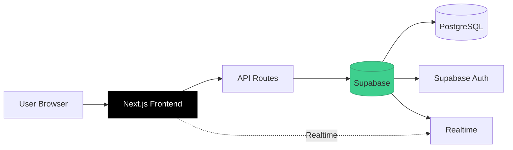
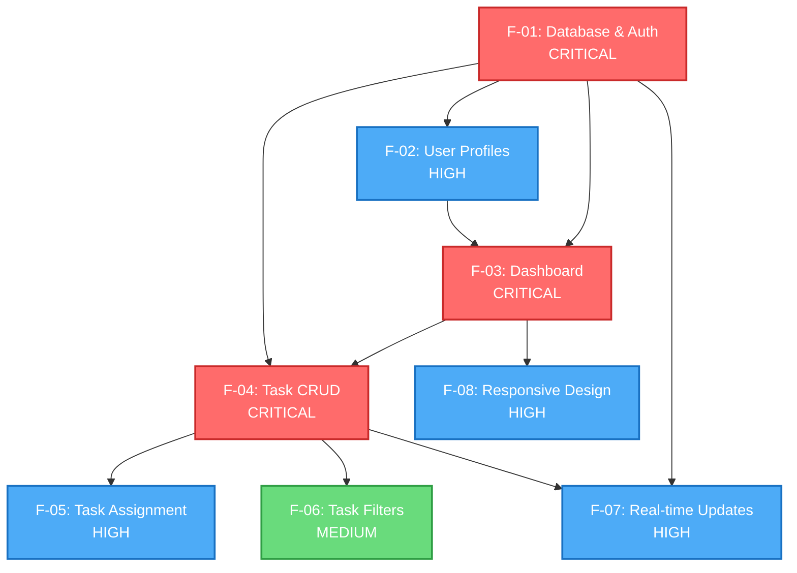

# SDD Workflow Example

**Complete Walkthrough**: From Project Idea to Full Specifications

**Version**: 1.0
**Last Updated**: 2025-11-27

---

## Overview

This document demonstrates the complete SDD workflow using a real example: building a "Task Manager for Teams" application.

We'll go through all 5 phases of the SDD process, showing:
- What the AI agent thinks at each step
- What outputs are generated
- How decisions are made
- What the final specification structure looks like

---

## 📥 User Input

**Scenario**: You're an entrepreneur with a project idea. You provide this structured information to an AI agent:

```markdown
Project Name: TaskManager

Project Description: A real-time task management application for small teams to collaborate on work with live updates and role-based access control.

Problem: Small teams struggle to coordinate work across scattered tools (email, Slack, spreadsheets) without a dedicated task management system.

Solution: Centralized task management platform with real-time updates, team collaboration, and simple assignment workflows.

Target Users:
- Small teams (5-15 people)
- Team leads and managers
- Individual contributors

Core Features (MVP):
  1. User accounts with email/password
  2. Create/edit/delete tasks
  3. Assign tasks to team members
  4. Mark tasks as complete
  5. Filter tasks by status (todo/in-progress/done)
  6. Dashboard showing my tasks and team tasks
  7. Real-time updates when someone changes a task

UI Product Format: Responsive web app

UI Design: Modern, professional, clean (inspired by Linear.app and Notion). Mobile-responsive for both desktop work and quick mobile checks.

Tech Stack:
  - Frontend: Next.js 14 for frontend
  - Backend: Supabase for database and auth
  - Deployment: Deploy on Vercel
```

---

## Phase 1: Requirements Understanding

### AI Agent Analysis

```markdown
## Project Analysis

**Name**: TaskManager

**Description**: Real-time task management application for small teams

**Problem**: Small teams struggle to coordinate work across scattered tools (email, Slack, spreadsheets)

**Solution**: Centralized task management platform with real-time updates and team collaboration

**Users**:
- Small teams (5-15 people)
- Team leads who assign work
- Individual contributors who complete tasks

**UI Product Format**: Responsive web app
- Desktop: Work environment (8+ hours of daily use)
- Mobile: Quick checks during commute or breaks (5-10 minutes)
- Design approach: Mode A (Self-Contained Design System)

**UI Design Approach**: Modern, professional, clean aesthetic inspired by Linear.app and Notion - works for both desktop and mobile

**Tech Stack**:
  - Frontend: Next.js 14, React 18, Tailwind CSS
  - Backend: Next.js API Routes, Supabase (PostgreSQL + Auth + Realtime)
  - Database: PostgreSQL (via Supabase)
  - Auth: Supabase Auth (email/password)
  - Deployment: Vercel (frontend + API) + Supabase Cloud (database)

**Features Identified**: 7 MVP features
  1. Database Schema & Authentication - CRITICAL (infrastructure)
  2. User Profiles - HIGH (user account management)
  3. Dashboard Framework - CRITICAL (main UI shell)
  4. Task CRUD - CRITICAL (core functionality)
  5. Task Assignment - HIGH (team collaboration)
  6. Task Filters - MEDIUM (usability enhancement)
  7. Real-time Updates - HIGH (collaboration feature)

**System Modules Needed**: 5 modules
  1. Architecture Overview - Foundation
  2. UI/UX Design System - Responsive web design (desktop + mobile)
  3. Database Schema - Data model + RLS policies
  4. Authentication - Supabase Auth integration
  5. Testing Strategy - How to verify correctness
```

### Decision Points

**Q: Should real-time updates be a feature or system module?**
**A**: Feature (F-07), because it's user-facing functionality, not infrastructure.

**Q: How many system modules?**
**A**: 4 is appropriate for a project of this size. Larger projects might have 6-8.

---

## Phase 2: System Design Planning

### AI Agent Planning

```markdown
## System Design Plan

**System Modules** (S-XX files):

- **S-00: Architecture Overview**
  - Purpose: 30,000 ft view of the entire system
  - Includes: System diagram, tech stack details, design principles
  - Dependencies: None (foundation document)

- **S-01: UI/UX Design System**
  - Purpose: Visual language and design tokens for the entire app
  - Includes: Colors, typography, spacing, component patterns, accessibility
  - Dependencies: None (defines visual foundation)
  - Used by: All features with UI (F-02 through F-08)

- **S-02: Testing Strategy**
  - Purpose: Complete testing approach (E2E, integration, unit)
  - Includes: Test pyramid, frameworks, Tier 1 tests, CI/CD
  - Dependencies: None (quality gates for all features)

- **S-03: Database Schema**
  - Purpose: Complete PostgreSQL schema with RLS policies
  - Includes: All tables, indexes, foreign keys, row-level security
  - Dependencies: None (foundational)

- **S-04: Authentication**
  - Purpose: Supabase Auth integration + user management
  - Includes: Signup, login, session management, auth hooks
  - Dependencies: S-03 (uses user_profiles table)

**Note on S-00, S-01, S-02 Mandatory Status:**

These three system modules are REQUIRED for ALL projects:
- **S-00** defines the architecture foundation
- **S-01** defines design standards based on UI Product Format:
  - **Responsive web app** (TaskManager's UI Product Format): Full UI design system with design tokens, colors, typography, components, responsive layouts for desktop + mobile
  - **Mobile app**: Native mobile design patterns and platform-specific guidelines
  - **CLI Tools**: Terminal UI design standards (colors, spinners, progress bars, text formatting)
  - **Data Pipelines/Backend Services**: Placeholder stating "No UI currently. Reserved for future monitoring dashboards."
  - **APIs/Component Libraries**: API documentation design standards or design token definitions
- **S-02** defines testing approach (quality gates apply to all projects)

Even projects without traditional UI must include S-01. You can always expand it later when adding monitoring dashboards or admin interfaces.

**S-01 Content Example for TaskManager Project**:

Since the UI Product Format is "responsive web app" with both desktop (8+ hours daily work) and mobile (5-10 minute quick checks) usage scenarios, we use **Mode A (Self-Contained Design)** with complete design tokens and design rationale:

```markdown
# S-01: UI/UX Design System

## Target Users & Usage Context

**Primary Users**: Small team members (5-15 people), age 25-45, moderate tech proficiency
**Usage Scenarios**:
- Desktop work environment (8+ hours/day of task management)
- Mobile quick checks (5-10 minutes during commute or breaks)
- Need fast task entry, clear prioritization, simple collaboration

## Design System Source - Mode A (Self-Contained)

**Visual Style**: Modern, Professional, Clean
**Design Philosophy**: Reduce cognitive load for busy professionals with clear hierarchy and minimal distractions

**Inspiration**: Linear.app (clean minimal UI), Notion (comfortable typography)

### Design Tokens

**Colors** (Rationale: Professional, non-distracting for long work sessions):
- Primary: `#475569` (Slate gray - professional, won't cause eye fatigue)
- Success: `#10b981` (Emerald - clear positive feedback)
- Warning: `#f59e0b` (Amber - attention without alarm)
- Error: `#ef4444` (Red - clear issues)
- Neutral: Warm gray scale `#f8fafc` to `#1e293b`

**Typography** (Rationale: Comfortable for long reading, age 25-45 group):
- Headings: Inter (clean, professional, web-safe)
- Body: System fonts (fast loading, familiar)
- Base size: 16px desktop, 18px mobile (readable for presbyopia consideration)

**Spacing** (Rationale: Generous whitespace reduces cognitive load):
- Base unit: 24px desktop, 16px mobile
- Card padding: 24px (comfortable breathing room)
- Stack spacing: 16px (clear visual separation)

**Component Patterns**:
- Buttons: Rounded corners (8px), clear hover states
- Forms: Single-column (easy scanning), inline validation
- Cards: Subtle shadow, clear boundaries

**Dark Mode**:
- True dark `#0f172a` with reduced contrast
- Essential for 8+ hour desktop work sessions
- Reduces eye strain in office environments

**Accessibility**:
- WCAG 2.1 AA minimum
- Keyboard navigation for all actions (power users)
- Clear focus indicators
```

This S-01 demonstrates Mode A approach with design rationale tied to target users and usage scenarios.

---

**Mermaid Diagram** (System Architecture):


---

## Phase 3: Feature Decomposition

### AI Agent Feature Breakdown

```markdown
## Feature Decomposition

| ID | Feature Name | Priority | Dependencies | Estimated Complexity |
|----|-------------|----------|--------------|---------------------|
| F-01 | Database Schema & Authentication | CRITICAL | None | Medium (setup) |
| F-02 | User Profiles & Settings | HIGH | F-01 | Low |
| F-03 | Dashboard Framework | CRITICAL | F-01, F-02 | Medium |
| F-04 | Task CRUD Operations | CRITICAL | F-01, F-03 | High |
| F-05 | Task Assignment System | HIGH | F-01, F-04 | Medium |
| F-06 | Task Filters & Search | MEDIUM | F-04 | Low |
| F-07 | Real-time Updates | HIGH | F-01, F-04 | Medium |
| F-08 | Responsive Design System | HIGH | F-03 | Medium |

**Feature Grouping**:
  - **Core Infrastructure** (must exist first):
    - F-01: Database Schema & Authentication

  - **Platform Features** (enable other features):
    - F-02: User Profiles & Settings
    - F-03: Dashboard Framework

  - **Core Functionality** (main user value):
    - F-04: Task CRUD Operations
    - F-05: Task Assignment System
    - F-06: Task Filters & Search

  - **Enhancement Features** (improve UX):
    - F-07: Real-time Updates
    - F-08: Responsive Design System

**Implementation Estimates** (1 developer):
  - Wave 1: 3-5 days
  - Wave 2: 4-6 days
  - Wave 3: 6-8 days
  - Wave 4: 3-4 days
  - **Total**: 16-23 days
```

### Decision Rationale

**Why F-01 includes both Database and Auth?**
These are tightly coupled infrastructure components that must exist before any feature works. Combining them reduces complexity.

**Why Dashboard (F-03) depends on Profiles (F-02)?**
The dashboard displays user information, so profiles must exist first.

**Why Real-time (F-07) is HIGH priority, not CRITICAL?**
The app functions without real-time updates (users can manually refresh). It's important for UX but not blocking.

---

## Phase 4: Dependency Graph Construction

### Mermaid Dependency Graph



### Implementation Waves

```markdown
## Implementation Waves

**Wave 1** (No dependencies):
- F-01: Database Schema & Authentication

**Wave 2** (Depends only on Wave 1):
- F-02: User Profiles & Settings (depends on F-01)

**Wave 3** (Depends on Wave 1-2):
- F-03: Dashboard Framework (depends on F-01, F-02)

**Wave 4** (Depends on Wave 1-3):
- F-04: Task CRUD Operations (depends on F-01, F-03)

**Wave 5** (Depends on Wave 1-4):
- F-05: Task Assignment System (depends on F-01, F-04)
- F-06: Task Filters & Search (depends on F-04)
- F-07: Real-time Updates (depends on F-01, F-04)
- F-08: Responsive Design System (depends on F-03)

**Critical Path** (longest chain):
F-01 → F-02 → F-03 → F-04 → F-05
(5 sequential features)

**Parallelization Opportunities**:
- Wave 5: F-05, F-06, F-07, F-08 can be built in parallel by 4 developers

**MVP Definition** (minimum viable product):
All CRITICAL priority features:
- F-01: Database & Auth ✓
- F-03: Dashboard ✓
- F-04: Task CRUD ✓
- Total: 3 features (Waves 1-4)

**V1.0 Definition** (full first version):
All CRITICAL + HIGH priority features:
- MVP (3 features)
- F-02: User Profiles
- F-05: Task Assignment
- F-07: Real-time Updates
- F-08: Responsive Design
- Total: 7 features (Waves 1-5, excluding F-06)

**V1.1 Definition** (polish):
- V1.0 + F-06: Task Filters & Search
- Total: 8 features (all features)
```

---

## Phase 5: File Generation

### Generated File Structure

```
teamtasker/
├── README.md
└── specs/
    ├── README.md
    │
    ├── system/
    │   ├── S-00-architecture.md
    │   ├── S-01-database-schema.md
    │   ├── S-02-authentication.md
    │   └── S-03-testing-strategy.md
    │
    └── features/
        ├── TEMPLATE.md
        ├── F-01-database-authentication.md
        ├── F-02-user-profiles.md
        ├── F-03-dashboard.md
        ├── F-04-task-crud.md
        ├── F-05-task-assignment.md
        ├── F-06-task-filters.md
        ├── F-07-realtime-updates.md
        └── F-08-responsive-design.md
```

### Sample File: F-04 Task CRUD

Here's what the generated spec looks like:

```markdown
# F-04: Task CRUD Operations

**Version**: 1.0
**Last Updated**: 2025-11-27
**Priority**: CRITICAL
**Status**: ✅ Spec Complete

---

## Quick Reference

**What**: Complete task management (create, read, update, delete, complete)

**Why**: Core functionality - users must be able to manage tasks

**Dependencies**:
- F-01: Database & Authentication - Provides tasks table + auth
- F-03: Dashboard Framework - Provides UI shell

**Used By**:
- F-05: Task Assignment System
- F-06: Task Filters & Search
- F-07: Real-time Updates

**Implementation Status**:
- [x] PRD documented
- [x] Technical design complete
- [x] Tests defined
- [ ] Implementation started
- [ ] Implementation complete
- [ ] Tests passing
- [ ] Deployed to production

---

## Dependencies

### Required Features
- F-01: Database & Authentication - Provides `tasks` table and user context
- F-03: Dashboard Framework - Provides layout and navigation

### Required System Modules
- S-01: UI/UX Design System - Defines visual design (colors, typography, component patterns)
- S-03: Database Schema - Defines tasks table structure
- S-04: Authentication - Provides user session

### Frontend Dependencies
- React Hook Form - Form validation
- Radix UI or shadcn/ui - UI components

### Backend Dependencies
- Supabase JS Client - Database operations

---

## PRD: Product Requirements

### Overview

Users can create, view, edit, delete, and complete tasks. Each task has:
- Title (required)
- Description (optional)
- Status (todo / in_progress / done)
- Due date (optional)
- Assigned user (optional, see F-05)
- Creator
- Created/updated timestamps

### User Flow

**Flow 1: Create Task**

**Step 1**: User clicks "+ New Task" button
- Location: Dashboard page, top-right corner
- Action: Opens task creation modal

**Step 2**: User fills form
- Fields:
  - Title (required, max 200 chars)
  - Description (optional, markdown supported, max 5000 chars)
  - Status (default: "todo")
  - Due date (optional, date picker)
- Validation: Title is required

**Step 3**: User clicks "Create Task"
- System: POST /api/tasks
- Success: Modal closes, task appears in list, success toast
- Failure: Error message shown in modal

---

**Flow 2: Edit Task**

**Step 1**: User clicks on task row
- Action: Opens task detail modal (read-only mode)

**Step 2**: User clicks "Edit" button
- Action: Modal switches to edit mode, form pre-filled

**Step 3**: User updates fields and clicks "Save"
- System: PATCH /api/tasks/:id
- Success: Modal closes, task updates in list, success toast
- Failure: Error message shown in modal

---

**Flow 3: Delete Task**

**Step 1**: User clicks "..." menu on task row
- Action: Dropdown menu appears

**Step 2**: User clicks "Delete"
- Action: Confirmation dialog appears
  - Message: "Are you sure you want to delete '[Task Title]'? This cannot be undone."

**Step 3**: User confirms
- System: DELETE /api/tasks/:id
- Success: Task removed from list, success toast
- Failure: Error toast

---

**Flow 4: Complete Task**

**Step 1**: User clicks checkbox on task row
- System: PATCH /api/tasks/:id { status: 'done', completed_at: now() }
- Success: Checkbox marked, task moves to "Done" section (if filtered view)
- Failure: Checkbox unchecks, error toast

---

### UI Components

**Component 1: Task List Table**
- **Location**: Main content area of dashboard
- **Purpose**: Display all tasks in a table
- **Columns**:
  - [ ] Checkbox (complete task)
  - Title (clickable, opens detail modal)
  - Status badge (todo/in-progress/done)
  - Assigned to (user avatar + name)
  - Due date (formatted: "Dec 25, 2025" or "Overdue")
  - ... menu (edit/delete actions)
- **Empty State**: "No tasks yet. Create your first task!"
- **Loading State**: Skeleton rows

**Component 2: Task Modal (Create/Edit/View)**
- **Location**: Center overlay
- **Modes**:
  - View: Read-only, shows "Edit" and "Delete" buttons
  - Edit: Form with "Save" and "Cancel" buttons
  - Create: Form with "Create Task" and "Cancel" buttons
- **Fields**: Title, Description (markdown editor), Status dropdown, Due date picker

**Component 3: Status Badge**
- **Appearance**:
  - todo: Gray badge "To Do"
  - in_progress: Blue badge "In Progress"
  - done: Green badge "Done"

---

### Business Rules

1. **Task Ownership**:
   - Users can only view/edit/delete tasks they created OR tasks assigned to them
   - Exception: Team admins can view all tasks (V2.0 feature)

2. **Status Transitions**:
   - Can move from any status to any status (no restrictions)
   - Completing a task (status → done) sets `completed_at` timestamp

3. **Due Dates**:
   - Optional
   - Cannot be in the past when creating task
   - Can edit to past date (in case of rescheduling)
   - Overdue tasks highlighted in red

4. **Deletion**:
   - Soft delete: Set `deleted_at` timestamp
   - Deleted tasks hidden from UI but retained in database for 30 days
   - Hard delete after 30 days (background job)

5. **Concurrent Edits**:
   - Use optimistic locking (version field)
   - If version mismatch, show error: "This task was updated by someone else. Please refresh and try again."

---

### Acceptance Criteria

- [ ] User can create a task with title only (minimum fields)
- [ ] User can create a task with all fields filled
- [ ] System prevents creating task with empty title
- [ ] User can view list of all their tasks
- [ ] User can click a task to view details
- [ ] User can edit a task they created
- [ ] User can delete a task they created
- [ ] System shows confirmation dialog before deletion
- [ ] User can complete a task by clicking checkbox
- [ ] Completed tasks show checkmark and "Done" status
- [ ] Overdue tasks are highlighted in red
- [ ] System handles 0 tasks gracefully (empty state)
- [ ] All API errors show user-friendly messages

---

## Technical Implementation

### API Endpoints

**Endpoint 1: GET /api/tasks**

**Purpose**: Fetch all tasks for current user

**Request**:
```typescript
// Query params
interface GetTasksQuery {
  status?: 'todo' | 'in_progress' | 'done'; // Optional filter
  assigned_to?: string; // Optional user ID filter
  sort?: 'created_at' | 'due_date' | 'title'; // Default: created_at
  order?: 'asc' | 'desc'; // Default: desc
}
```

**Response** (Success - 200):
```typescript
interface GetTasksResponse {
  data: Task[];
  count: number;
}

interface Task {
  id: string;
  title: string;
  description: string | null;
  status: 'todo' | 'in_progress' | 'done';
  due_date: string | null; // ISO 8601
  assigned_to: string | null;
  created_by: string;
  completed_at: string | null;
  created_at: string;
  updated_at: string;
  version: number; // For optimistic locking
}
```

**RLS Policy**: Users see tasks they created OR tasks assigned to them

---

**Endpoint 2: POST /api/tasks**

**Purpose**: Create new task

**Request**:
```typescript
interface CreateTaskRequest {
  title: string; // Required, max 200 chars
  description?: string; // Optional, max 5000 chars
  status?: 'todo' | 'in_progress' | 'done'; // Default: 'todo'
  due_date?: string; // ISO 8601, optional
  assigned_to?: string; // User ID, optional (see F-05)
}
```

**Response** (Success - 201):
```typescript
interface CreateTaskResponse {
  data: Task;
  message: string; // "Task created successfully"
}
```

**Response** (Error - 400):
```typescript
interface ErrorResponse {
  error: string; // "Title is required"
  code: 'VALIDATION_ERROR';
}
```

**Validation**:
- Title: required, 1-200 characters
- Description: optional, max 5000 characters
- Due date: must be valid ISO 8601 date

---

**Endpoint 3: PATCH /api/tasks/:id**

**Purpose**: Update existing task

**Request**:
```typescript
interface UpdateTaskRequest {
  title?: string;
  description?: string;
  status?: 'todo' | 'in_progress' | 'done';
  due_date?: string | null; // null removes due date
  assigned_to?: string | null;
  version: number; // For optimistic locking
}
```

**Response** (Success - 200):
```typescript
interface UpdateTaskResponse {
  data: Task; // Updated task with new version number
  message: string;
}
```

**Response** (Error - 409):
```typescript
interface ConflictError {
  error: "Task was updated by someone else";
  code: 'CONFLICT';
  current_version: number;
}
```

**Business Logic**:
- Check version number matches database
- If status changed to 'done', set completed_at = now()
- If status changed from 'done' to other, set completed_at = null
- Increment version number

---

**Endpoint 4: DELETE /api/tasks/:id**

**Purpose**: Soft-delete task

**Request**: No body

**Response** (Success - 200):
```typescript
interface DeleteTaskResponse {
  message: "Task deleted successfully";
}
```

**Response** (Error - 403):
```typescript
interface ForbiddenError {
  error: "You don't have permission to delete this task";
  code: 'FORBIDDEN';
}
```

**Business Logic**:
- Set deleted_at = now()
- RLS policy prevents viewing deleted tasks

---

### Database Schema

**Table: tasks**

```sql
CREATE TABLE tasks (
  id UUID PRIMARY KEY DEFAULT uuid_generate_v4(),
  title VARCHAR(200) NOT NULL,
  description TEXT,
  status VARCHAR(20) NOT NULL DEFAULT 'todo'
    CHECK (status IN ('todo', 'in_progress', 'done')),
  due_date TIMESTAMPTZ,
  assigned_to UUID REFERENCES user_profiles(id) ON DELETE SET NULL,
  created_by UUID NOT NULL REFERENCES user_profiles(id) ON DELETE CASCADE,
  completed_at TIMESTAMPTZ,
  version INTEGER NOT NULL DEFAULT 1, -- For optimistic locking
  created_at TIMESTAMPTZ DEFAULT NOW(),
  updated_at TIMESTAMPTZ DEFAULT NOW(),
  deleted_at TIMESTAMPTZ -- Soft delete
);

-- Indexes for performance
CREATE INDEX idx_tasks_created_by ON tasks(created_by)
  WHERE deleted_at IS NULL;

CREATE INDEX idx_tasks_assigned_to ON tasks(assigned_to)
  WHERE deleted_at IS NULL;

CREATE INDEX idx_tasks_status ON tasks(status)
  WHERE deleted_at IS NULL;

CREATE INDEX idx_tasks_due_date ON tasks(due_date)
  WHERE deleted_at IS NULL AND due_date IS NOT NULL;

-- Trigger to update updated_at
CREATE TRIGGER update_tasks_updated_at
  BEFORE UPDATE ON tasks
  FOR EACH ROW
  EXECUTE FUNCTION update_updated_at_column();

-- RLS Policies
ALTER TABLE tasks ENABLE ROW LEVEL SECURITY;

-- Policy 1: Users can view tasks they created or are assigned to
CREATE POLICY "Users can view own tasks"
  ON tasks FOR SELECT
  USING (
    deleted_at IS NULL AND (
      auth.uid() = created_by OR
      auth.uid() = assigned_to
    )
  );

-- Policy 2: Users can create tasks
CREATE POLICY "Users can create tasks"
  ON tasks FOR INSERT
  WITH CHECK (auth.uid() = created_by);

-- Policy 3: Users can update tasks they created
CREATE POLICY "Users can update own tasks"
  ON tasks FOR UPDATE
  USING (auth.uid() = created_by)
  WITH CHECK (auth.uid() = created_by);

-- Policy 4: Users can delete tasks they created
CREATE POLICY "Users can delete own tasks"
  ON tasks FOR DELETE
  USING (auth.uid() = created_by);
```

---

### Frontend Components

**Component 1: TaskList**

**File**: `src/components/tasks/TaskList.tsx`

**Props**:
```typescript
interface TaskListProps {
  filters?: {
    status?: Task['status'];
    assigned_to?: string;
  };
}
```

**State**:
```typescript
const [tasks, setTasks] = useState<Task[]>([]);
const [loading, setLoading] = useState(true);
const [selectedTask, setSelectedTask] = useState<Task | null>(null);
const [modalMode, setModalMode] = useState<'view' | 'edit' | 'create' | null>(null);
```

**Key Functions**:
- `fetchTasks()`: GET /api/tasks with filters
- `handleTaskClick(task)`: Open modal in view mode
- `handleCreateClick()`: Open modal in create mode
- `handleComplete(taskId)`: PATCH /api/tasks/:id
- `handleDelete(taskId)`: DELETE /api/tasks/:id with confirmation

**Example Implementation**:
```typescript
export default function TaskList({ filters }: TaskListProps) {
  // ... state and hooks ...

  const fetchTasks = async () => {
    setLoading(true);
    const { data, error } = await supabase
      .from('tasks')
      .select('*')
      .match(filters || {})
      .order('created_at', { ascending: false });

    if (error) {
      toast.error('Failed to load tasks');
      return;
    }

    setTasks(data);
    setLoading(false);
  };

  return (
    <div>
      <header>
        <h1>Tasks</h1>
        <Button onClick={() => setModalMode('create')}>
          + New Task
        </Button>
      </header>

      {loading ? (
        <TaskListSkeleton />
      ) : tasks.length === 0 ? (
        <EmptyState />
      ) : (
        <table>
          {/* Table rows */}
        </table>
      )}

      {modalMode && (
        <TaskModal
          mode={modalMode}
          task={selectedTask}
          onClose={() => setModalMode(null)}
          onSuccess={fetchTasks}
        />
      )}
    </div>
  );
}
```

---

**Component 2: TaskModal**

**File**: `src/components/tasks/TaskModal.tsx`

**Props**:
```typescript
interface TaskModalProps {
  mode: 'view' | 'edit' | 'create';
  task?: Task | null; // Required for view/edit modes
  onClose: () => void;
  onSuccess: () => void; // Callback after create/update/delete
}
```

**Form State** (using React Hook Form):
```typescript
const { register, handleSubmit, formState: { errors } } = useForm<TaskFormData>({
  defaultValues: task || {
    title: '',
    description: '',
    status: 'todo',
    due_date: null,
  }
});
```

---

### State Management

Using Zustand for client-side task cache:

```typescript
interface TaskStore {
  tasks: Task[];
  loading: boolean;
  fetchTasks: (filters?: TaskFilters) => Promise<void>;
  createTask: (data: CreateTaskRequest) => Promise<void>;
  updateTask: (id: string, data: UpdateTaskRequest) => Promise<void>;
  deleteTask: (id: string) => Promise<void>;
  completeTask: (id: string) => Promise<void>;
}

const useTaskStore = create<TaskStore>((set, get) => ({
  tasks: [],
  loading: false,

  fetchTasks: async (filters) => {
    set({ loading: true });
    const { data, error } = await supabase
      .from('tasks')
      .select('*')
      .match(filters || {});

    if (!error) {
      set({ tasks: data, loading: false });
    }
  },

  createTask: async (taskData) => {
    const { data, error } = await supabase
      .from('tasks')
      .insert(taskData)
      .select()
      .single();

    if (!error) {
      set((state) => ({ tasks: [data, ...state.tasks] }));
    }
  },

  updateTask: async (id, taskData) => {
    const { data, error } = await supabase
      .from('tasks')
      .update({ ...taskData, version: taskData.version + 1 })
      .eq('id', id)
      .eq('version', taskData.version) // Optimistic locking
      .select()
      .single();

    if (error?.code === 'PGRST116') {
      throw new Error('CONFLICT');
    }

    if (!error) {
      set((state) => ({
        tasks: state.tasks.map(t => t.id === id ? data : t)
      }));
    }
  },

  // ... other methods
}));
```

---

## Tests

### Tier 1 Critical Path Test

**Test Name**: `Task CRUD - Happy Path`

**Description**: User can create, view, edit, and complete a task

**Preconditions**:
- User is logged in
- No existing tasks

**Steps**:
1. Navigate to dashboard
2. Click "+ New Task"
3. Fill title: "Test Task"
4. Click "Create Task"
5. Verify task appears in list
6. Click on task row
7. Click "Edit"
8. Change title to "Updated Task"
9. Click "Save"
10. Verify updated title in list
11. Click checkbox to complete task
12. Verify task shows "Done" status

**Expected Results**:
- Task creation succeeds
- Task appears in list immediately
- Task edit succeeds
- Task completion succeeds
- All UI updates reflect changes

**Failure Impact**: ❌ **BLOCKS DEPLOYMENT** - Core functionality broken

---

### E2E Tests

**Test 1: Create Task with All Fields**
```typescript
test('should create task with all fields', async ({ page }) => {
  await page.goto('/dashboard');
  await page.click('[data-testid="new-task-button"]');

  await page.fill('[data-testid="task-title"]', 'Complete Project');
  await page.fill('[data-testid="task-description"]', 'Finish all specs');
  await page.selectOption('[data-testid="task-status"]', 'in_progress');
  await page.fill('[data-testid="task-due-date"]', '2025-12-31');

  await page.click('[data-testid="create-task-button"]');

  await expect(page.locator('text=Complete Project')).toBeVisible();
  await expect(page.locator('text=In Progress')).toBeVisible();
});
```

**Test 2: Validation Error - Empty Title**
```typescript
test('should show error when title is empty', async ({ page }) => {
  await page.goto('/dashboard');
  await page.click('[data-testid="new-task-button"]');
  await page.click('[data-testid="create-task-button"]'); // Submit without title

  await expect(page.locator('text=Title is required')).toBeVisible();
});
```

**Test 3: Optimistic Locking - Concurrent Edit**
```typescript
test('should detect concurrent edits', async ({ page, context }) => {
  // Create task
  const taskId = await createTask({ title: 'Original' });

  // Open task in two tabs
  const page1 = page;
  const page2 = await context.newPage();

  await page1.goto(`/dashboard`);
  await page2.goto(`/dashboard`);

  // Both open edit mode
  await page1.click(`[data-task-id="${taskId}"]`);
  await page1.click('[data-testid="edit-button"]');

  await page2.click(`[data-task-id="${taskId}"]`);
  await page2.click('[data-testid="edit-button"]');

  // Page 1 saves first
  await page1.fill('[data-testid="task-title"]', 'Updated by User 1');
  await page1.click('[data-testid="save-button"]');

  // Page 2 tries to save
  await page2.fill('[data-testid="task-title"]', 'Updated by User 2');
  await page2.click('[data-testid="save-button"]');

  // Expect conflict error
  await expect(page2.locator('text=updated by someone else')).toBeVisible();
});
```

---

### Integration Tests

**Test 1: API - Create Task**
```typescript
describe('POST /api/tasks', () => {
  it('should create task with valid data', async () => {
    const response = await request('/api/tasks', {
      method: 'POST',
      headers: { Authorization: `Bearer ${testUserToken}` },
      body: {
        title: 'Test Task',
        status: 'todo'
      }
    });

    expect(response.status).toBe(201);
    expect(response.data.data).toMatchObject({
      title: 'Test Task',
      status: 'todo',
      created_by: testUserId
    });
  });

  it('should reject empty title', async () => {
    const response = await request('/api/tasks', {
      method: 'POST',
      headers: { Authorization: `Bearer ${testUserToken}` },
      body: { title: '' }
    });

    expect(response.status).toBe(400);
    expect(response.data.code).toBe('VALIDATION_ERROR');
  });
});
```

**Test 2: RLS Policy - Cannot View Others' Tasks**
```typescript
describe('RLS Policies', () => {
  it('should not allow viewing other users tasks', async () => {
    // Create task as user1
    const task = await createTaskAs(user1, { title: 'User 1 Task' });

    // Try to fetch as user2
    const { data, error } = await supabaseAs(user2)
      .from('tasks')
      .select('*')
      .eq('id', task.id);

    expect(data).toEqual([]);
    expect(error).toBeNull(); // No error, just empty result
  });
});
```

---

### Unit Tests

**Test 1: TaskList Component**
```typescript
describe('TaskList Component', () => {
  it('should render empty state when no tasks', () => {
    const { getByText } = render(<TaskList />);

    expect(getByText('No tasks yet. Create your first task!')).toBeInTheDocument();
  });

  it('should call onTaskComplete when checkbox clicked', async () => {
    const mockComplete = jest.fn();
    const tasks = [{ id: '1', title: 'Task 1', status: 'todo' }];

    const { getByRole } = render(
      <TaskList tasks={tasks} onTaskComplete={mockComplete} />
    );

    const checkbox = getByRole('checkbox');
    fireEvent.click(checkbox);

    expect(mockComplete).toHaveBeenCalledWith('1');
  });
});
```

**Test 2: useTaskStore Hook**
```typescript
describe('useTaskStore', () => {
  it('should add task to store on createTask', async () => {
    const { result } = renderHook(() => useTaskStore());

    await act(async () => {
      await result.current.createTask({ title: 'New Task', status: 'todo' });
    });

    expect(result.current.tasks).toHaveLength(1);
    expect(result.current.tasks[0].title).toBe('New Task');
  });
});
```

---

## Notes

### Future Enhancements

- **Bulk Actions** (V1.5): Select multiple tasks, bulk complete/delete
- **Task Templates** (V2.0): Save common task configurations
- **Subtasks** (V2.0): Tasks can have nested subtasks
- **Task Comments** (V2.0): Team discussion on tasks
- **File Attachments** (V2.0): Attach files to tasks

### Known Limitations

- No task history/audit log (who changed what when)
- No task recurrence (daily/weekly repeating tasks)
- No task dependencies (Task A blocks Task B)
- Soft delete retention is 30 days (not configurable)

### References

- Supabase RLS Guide: https://supabase.com/docs/guides/auth/row-level-security
- React Hook Form: https://react-hook-form.com/
- Optimistic Locking Pattern: https://en.wikipedia.org/wiki/Optimistic_concurrency_control
```

---

That's a complete example of one feature spec! The other 7 features would follow this exact same structure.

---

## Quality Validation Results

After generating all specs, run the quality checklist:

```markdown
### Structure Validation
- [x] Directory structure matches template
- [x] All files follow naming convention (S-00 to S-03, F-01 to F-08)
- [x] TEMPLATE.md exists in features/ directory
- [x] Both README.md files exist (root + specs/)

### Content Completeness
- [x] S-00 architecture document exists and is complete
- [x] All system modules (S-01, S-02, S-03) have dependencies declared
- [x] All features (F-01 to F-08) have dependencies declared
- [x] Every feature has all required sections

### Dependency Validation
- [x] No circular dependencies exist
- [x] All referenced dependencies actually exist
- [x] Dependency graph is a valid DAG
- [x] Implementation waves are correctly ordered (Wave 1-5)
- [x] Critical path identified: F-01 → F-02 → F-03 → F-04 → F-05

### Navigation Aids
- [x] specs/README.md has complete feature index table (8 features)
- [x] specs/README.md has Mermaid dependency graph
- [x] Root README.md has quick links to key documents
- [x] Each file has "Related Documents" section

### Diagram Validation
- [x] All Mermaid diagrams use valid syntax (tested on mermaid.live)
- [x] System architecture diagram exists in S-00
- [x] Dependency graph exists in specs/README.md

### Test Coverage
- [x] All CRITICAL features (F-01, F-03, F-04) have Tier 1 tests defined
- [x] All features have E2E test scenarios
- [x] Integration tests cover API endpoints
- [x] Unit tests cover component logic

**Result**: ✅ All checks passed - Specifications are complete and valid
```

---

## Common Questions

### Q: How long does this process take?

**For AI Agent**: 10-30 minutes depending on project complexity
- Simple (< 10 features): 10-15 minutes
- Medium (10-20 features): 15-25 minutes
- Large (> 20 features): 25-40 minutes

**For Human**: 2-5 days for a medium project
- Day 1: Requirements analysis (Phase 1-2)
- Day 2: Feature decomposition (Phase 3)
- Day 3: System design specs (S-XX files)
- Day 4-5: Feature specs (F-XX files)

---

### Q: Can I modify specs after generation?

**Yes!** Specs are living documents. Update them as requirements change. Just remember to:
1. Update dependent files when changing dependencies
2. Increment version numbers
3. Update "Last Updated" dates
4. Keep dependency graph in sync

---

### Q: What if I realize I need another feature mid-project?

Add it! Follow the template:
1. Assign next F-XX number (e.g., F-09)
2. Copy TEMPLATE.md
3. Fill in all sections
4. Add to Feature Index table in specs/README.md
5. Update dependency graph if needed

---

### Q: How do I handle feature requests that don't fit the structure?

Ask yourself:
- **Is it a new feature?** → Create F-XX file
- **Is it a modification to existing feature?** → Update existing F-XX file
- **Is it cross-cutting (affects many features)?** → Create S-XX system module or update existing one
- **Is it a bug fix?** → Update implementation, no spec change needed

---

## Summary

This workflow demonstrates the complete SDD process:
1. Start with simple idea
2. AI analyzes and plans
3. Generate structured specs
4. Validate quality
5. Begin implementation

**Key Takeaway**: Spending time upfront on good specs saves 10x time during implementation. You now have a blueprint that any developer (human or AI) can follow to build the exact same product.

---

**End of Workflow Example**

**For more details, see**:
- [SDD-TEMPLATE-PROMPT.md](./SDD-TEMPLATE-PROMPT.md) - Complete prompt
- [SDD-QUICK-REFERENCE.md](./SDD-QUICK-REFERENCE.md) - Quick reference card
- [templates/](./templates/) - File templates
