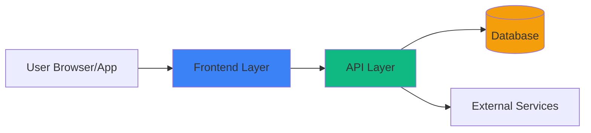

# S-00: [Project Name] Architecture

## Quick Reference

- **Purpose**: 30,000 ft system overview
- **Scope**: Complete architecture + tech stack + design principles
- **Dependencies**: None (foundation document)
- **Used By**: All system modules (S-01 through S-XX) and all features

---

## System Overview

[2-3 paragraphs describing what the system does, its core purpose, and main capabilities]

**Example**:
> This is a [type of application] that helps [target users] to [main purpose]. The system provides [key capabilities] through [delivery method]. Built with [primary tech stack], it emphasizes [key characteristics like scalability, security, performance, etc.].

---

## Architecture Diagram

**Diagram Notes**:
- [Explain key flows and interactions]
- [Highlight critical paths]
- [Note any async/background processes]

---

## Tech Stack

### Frontend

- **Framework**: [e.g., Next.js 14, React Native, Vue 3, Svelte]
- **State Management**: [e.g., Zustand, Redux Toolkit, Pinia, Context API]
- **Styling**: [e.g., Tailwind CSS, CSS Modules, Styled Components]
- **UI Components**: [e.g., shadcn/ui, Radix UI, Headless UI, Material-UI]
- **Build Tool**: [e.g., Vite, Webpack, Turbopack]

### Backend

- **Runtime**: [e.g., Node.js 20, Python 3.11, Go 1.21]
- **Framework**: [e.g., Next.js API Routes, Express, FastAPI, Fiber]
- **Database**: [e.g., PostgreSQL 15 via Supabase, MongoDB Atlas, MySQL]
- **ORM/Query Builder**: [e.g., Prisma, Drizzle, TypeORM, SQLAlchemy]
- **Authentication**: [e.g., Supabase Auth, NextAuth.js, Auth0, Clerk]
- **File Storage**: [e.g., Supabase Storage, AWS S3, Cloudinary]

### Infrastructure

- **Hosting**: [e.g., Vercel, AWS (EC2/ECS/Lambda), Railway, Fly.io]
- **Database Hosting**: [e.g., Supabase, AWS RDS, PlanetScale, Neon]
- **CDN**: [e.g., Vercel Edge Network, Cloudflare, AWS CloudFront]
- **Monitoring**: [e.g., Sentry, LogRocket, New Relic, Datadog]
- **CI/CD**: [e.g., GitHub Actions, GitLab CI, CircleCI, Vercel Auto-deploy]

### Development Tools

- **Language**: [e.g., TypeScript 5.3, Python 3.11, Go 1.21]
- **Package Manager**: [e.g., pnpm, npm, yarn, pip, go mod]
- **Linting**: [e.g., ESLint, Prettier, Ruff, golangci-lint]
- **Testing**: See S-02 Testing Strategy
- **Version Control**: [e.g., Git + GitHub, GitLab, Bitbucket]

---

## Design Principles

### 1. [Principle Name]
**Description**: [What this principle means for the project]

**Rationale**: [Why this principle is important]

**Implementation**: [How this principle is enforced in practice]

**Example**: Principle: "API-First Design"
- Description: All features expose API endpoints before UI implementation
- Rationale: Enables mobile apps, third-party integrations, and parallel frontend/backend development
- Implementation: OpenAPI specs written first, backend implements spec, frontend consumes API

### 2. [Principle Name]
[Repeat structure]

**Common Principles** (choose what applies):
- **Simplicity First**: Avoid premature optimization, choose boring technology
- **Security by Default**: Authentication required, data encrypted, input validated
- **Progressive Enhancement**: Core features work without JavaScript
- **Mobile-First**: Design for smallest screen, enhance for larger
- **Performance Budgets**: Page load < 2s, API response < 200ms
- **Accessibility**: WCAG 2.1 AA minimum, keyboard navigation, screen reader support

---

## Key Architectural Decisions

### Decision 1: [Technology/Pattern Choice]
**Decision**: [What was decided]

**Alternatives Considered**: [Other options that were evaluated]

**Rationale**: [Why this choice was made]

**Trade-offs**:
- ✅ Pros: [Benefits of this choice]
- ❌ Cons: [Drawbacks or limitations]

**Example**:
> **Decision**: Use Supabase for backend (Database + Auth + Storage)
> **Alternatives**: Firebase, AWS Amplify, custom backend
> **Rationale**: Supabase provides PostgreSQL with Row-Level Security, avoiding vendor lock-in while offering managed infrastructure
> **Trade-offs**:
> ✅ Pros: Open source, SQL database, real-time subscriptions, generous free tier
> ❌ Cons: Less mature than Firebase, fewer third-party integrations

### Decision 2: [Monorepo vs. Multi-repo]
[Repeat structure]

---

## Data Flow

### User Request Flow
1. **User Action**: [User initiates action in UI]
2. **Frontend Processing**: [Client-side validation, state updates]
3. **API Request**: [HTTP request to backend endpoint]
4. **Authentication**: [Token validation, permission checks]
5. **Business Logic**: [Core processing, calculations]
6. **Database Operations**: [Read/write to database]
7. **Response**: [Return data to frontend]
8. **UI Update**: [Render new state]

### Background Processes
- **Scheduled Jobs**: [e.g., Daily report generation at 2 AM UTC]
- **Event-Driven**: [e.g., Send email when user signs up]
- **Real-time**: [e.g., WebSocket updates for chat messages]

---

## Security Considerations

### Authentication
- **Method**: [e.g., JWT tokens, Session cookies, OAuth 2.0]
- **Token Storage**: [e.g., HttpOnly cookies, Secure localStorage]
- **Session Duration**: [e.g., 7 days, refresh tokens for 30 days]
- **Multi-factor**: [If applicable, e.g., TOTP, SMS]

### Authorization
- **Model**: [e.g., Role-Based Access Control (RBAC), Attribute-Based (ABAC)]
- **Enforcement**: [e.g., Row-Level Security in database, API middleware]
- **Roles**: [e.g., Admin, Editor, Viewer]

### Data Protection
- **Encryption at Rest**: [e.g., PostgreSQL encryption, S3 bucket encryption]
- **Encryption in Transit**: [e.g., TLS 1.3 for all connections]
- **Sensitive Data**: [e.g., PII hashed, passwords bcrypt hashed]
- **API Security**: [e.g., Rate limiting, CORS policies, input validation]

### Compliance
- **Standards**: [e.g., GDPR, CCPA, SOC 2, HIPAA - if applicable]
- **Data Retention**: [e.g., User data deleted after 90 days of account closure]
- **Privacy**: [e.g., Cookie consent, data export available]

---

## Scalability & Performance

### Expected Load
- **Users**: [e.g., 10,000 DAU initially, 100,000 DAU in 12 months]
- **Requests**: [e.g., 100 req/sec average, 1000 req/sec peak]
- **Data**: [e.g., 1 million records initially, 10 million in 12 months]

### Scaling Strategy
- **Horizontal Scaling**: [e.g., Auto-scaling API containers, CDN for static assets]
- **Database Scaling**: [e.g., Read replicas for queries, connection pooling]
- **Caching**: [e.g., Redis for session data, CDN for images]
- **Async Processing**: [e.g., Background jobs for heavy computations]

### Performance Targets
- **Page Load**: [e.g., < 2 seconds on 3G connection]
- **API Response**: [e.g., < 200ms p95, < 500ms p99]
- **Database Queries**: [e.g., < 50ms for indexed queries]
- **Uptime**: [e.g., 99.9% SLA]

### Monitoring
- **Metrics Tracked**: [e.g., Response times, error rates, CPU/memory usage]
- **Alerting**: [e.g., PagerDuty for P0 incidents, Slack for warnings]
- **Logging**: [e.g., Structured JSON logs, 30-day retention]

---

## Deployment Architecture

### Environments
- **Development**: [e.g., Local development with Docker Compose]
- **Staging**: [e.g., Vercel preview deployments, Supabase staging project]
- **Production**: [e.g., Vercel production, Supabase production project]

### Deployment Process
1. **Code Push**: [e.g., Push to GitHub main branch]
2. **CI Pipeline**: [e.g., Run tests, linting, type checks]
3. **Build**: [e.g., Vercel builds Next.js app]
4. **Deploy**: [e.g., Automatic deployment to production]
5. **Smoke Tests**: [e.g., Health check endpoints verified]
6. **Rollback**: [e.g., Instant rollback via Vercel dashboard]

### Database Migrations
- **Tool**: [e.g., Prisma Migrate, Supabase Migrations]
- **Strategy**: [e.g., Forward-only migrations, no destructive changes in production]
- **Rollback Plan**: [e.g., Automated backups, manual rollback procedure documented]

---

## Integration Points

### Third-Party Services
- **Payment**: [e.g., Stripe for subscriptions, webhooks for events]
- **Email**: [e.g., Resend/SendGrid for transactional emails]
- **Analytics**: [e.g., PostHog for product analytics, Plausible for web analytics]
- **AI/ML**: [e.g., OpenAI API for chat completions]

### External APIs
- **Authentication**: [e.g., Google OAuth, GitHub OAuth]
- **Data Sources**: [e.g., Third-party REST APIs, webhooks]

---

## Related Documents

### System Modules
- **S-01**: UI/UX Design System - Visual language and design tokens
- **S-02**: Testing Strategy - Quality assurance approach
- **S-03**: Database Schema - Data model and relationships
- **S-04**: Authentication - User identity and access control
- **S-05+**: Project-specific modules

### Features
- **F-01**: Database & Authentication - Core infrastructure setup
- **All Features**: Reference this architecture for tech stack decisions

---

## Notes

### Future Considerations
- [Planned architectural improvements]
- [Technical debt to address]
- [Scaling milestones]

### Known Limitations
- [Current constraints]
- [Areas requiring improvement]

### Migration Path
[If this is a redesign or migration from existing system]
- **From**: [Previous architecture/stack]
- **To**: [Current architecture/stack]
- **Timeline**: [Migration schedule]
- **Risks**: [Migration risks and mitigations]

---

**Last Updated**: YYYY-MM-DD
**Version**: 1.0
**Author**: [Team/Person responsible]
