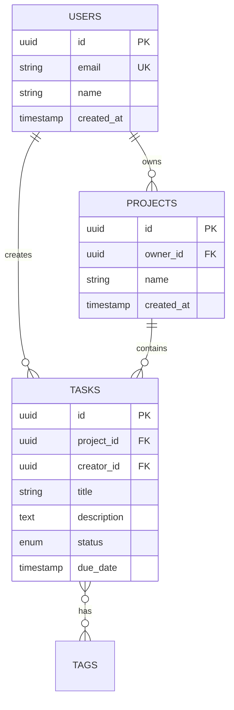

# S-03: Database Schema

## Quick Reference

- **Purpose**: Complete database schema definition
- **Database**: [PostgreSQL/MySQL/MongoDB/etc.]
- **ORM**: [Prisma/TypeORM/Drizzle/SQLAlchemy/etc.]
- **Dependencies**: None (foundational)
- **Used By**: S-04 (Authentication), F-01 (Database setup), all features with data

---

## Schema Overview

[2-3 paragraphs describing the data model and key entities]

**Example**:
> The database stores user profiles, tasks, projects, and related metadata. Users can create multiple projects, each containing multiple tasks. Tasks can be assigned to users and tagged for organization. All user data is protected by Row-Level Security (RLS) policies.

---

## Entity Relationship Diagram



---

## Tables

### Table: `users`
**Purpose**: Store user profiles and authentication data

**Schema**:
```sql
CREATE TABLE users (
  id UUID PRIMARY KEY DEFAULT gen_random_uuid(),
  email TEXT UNIQUE NOT NULL,
  name TEXT NOT NULL,
  avatar_url TEXT,
  created_at TIMESTAMPTZ DEFAULT NOW(),
  updated_at TIMESTAMPTZ DEFAULT NOW()
);
```

**Indexes**:
```sql
CREATE INDEX users_email_idx ON users(email);
CREATE INDEX users_created_at_idx ON users(created_at DESC);
```

**RLS Policies** (if using Supabase/PostgreSQL RLS):
```sql
-- Users can read their own data
CREATE POLICY "Users can view own data"
  ON users FOR SELECT
  USING (auth.uid() = id);

-- Users can update their own data
CREATE POLICY "Users can update own data"
  ON users FOR UPDATE
  USING (auth.uid() = id);
```

---

### Table: `[table_name]`
[Repeat structure for each table]

---

## Prisma Schema (or equivalent)

```prisma
generator client {
  provider = "prisma-client-js"
}

datasource db {
  provider = "postgresql"
  url      = env("DATABASE_URL")
}

model User {
  id        String   @id @default(uuid())
  email     String   @unique
  name      String
  avatarUrl String?  @map("avatar_url")
  createdAt DateTime @default(now()) @map("created_at")
  updatedAt DateTime @updatedAt @map("updated_at")

  // Relations
  tasks     Task[]
  projects  Project[]

  @@map("users")
}

model Project {
  id        String   @id @default(uuid())
  name      String
  ownerId   String   @map("owner_id")
  createdAt DateTime @default(now()) @map("created_at")

  // Relations
  owner     User     @relation(fields: [ownerId], references: [id], onDelete: Cascade)
  tasks     Task[]

  @@map("projects")
}

model Task {
  id          String   @id @default(uuid())
  title       String
  description String?
  status      TaskStatus @default(TODO)
  projectId   String   @map("project_id")
  creatorId   String   @map("creator_id")
  dueDate     DateTime? @map("due_date")
  createdAt   DateTime @default(now()) @map("created_at")

  // Relations
  project     Project  @relation(fields: [projectId], references: [id], onDelete: Cascade)
  creator     User     @relation(fields: [creatorId], references: [id])

  @@index([projectId])
  @@index([creatorId])
  @@map("tasks")
}

enum TaskStatus {
  TODO
  IN_PROGRESS
  DONE
}
```

---

## Migrations Strategy

- **Migration Tool**: [Prisma Migrate / Supabase Migrations / etc.]
- **Migration Location**: `/prisma/migrations/` or `/supabase/migrations/`
- **Naming Convention**: `YYYYMMDDHHMMSS_description.sql`
- **Forward-Only**: Never destructive changes in production without backup

**Example Migration**:
```sql
-- 20250128000000_create_users_table.sql
CREATE TABLE users (
  id UUID PRIMARY KEY DEFAULT gen_random_uuid(),
  email TEXT UNIQUE NOT NULL,
  name TEXT NOT NULL,
  created_at TIMESTAMPTZ DEFAULT NOW()
);
```

---

## Data Seeding

**Seed File**: `/prisma/seed.ts` or `/db/seeds/`

**Seed Command**: `npm run db:seed`

**Seed Data**:
```typescript
// prisma/seed.ts
const seedUsers = async () => {
  await prisma.user.createMany({
    data: [
      { email: 'admin@example.com', name: 'Admin User' },
      { email: 'user@example.com', name: 'Test User' },
    ],
  });
};
```

---

## Security

### Row-Level Security (RLS)
[If using Supabase/PostgreSQL]

- **Default Policy**: Deny all access
- **User Data**: Users can only access their own data
- **Service Role**: Bypass RLS for server-side operations

### Data Encryption
- **At Rest**: Database encryption enabled
- **In Transit**: TLS connections only
- **Sensitive Fields**: [e.g., SSN, credit cards] encrypted at application level

---

## Performance

### Indexes
- All foreign keys indexed
- Common query patterns indexed (e.g., `created_at DESC`)
- Composite indexes for complex queries

### Query Optimization
- Use SELECT with specific columns (avoid SELECT *)
- Pagination for large datasets
- Database connection pooling

---

## Related Documents

- S-04: Authentication (uses `users` table)
- F-01: Database & Authentication setup
- All features with database operations

---

**Last Updated**: YYYY-MM-DD
