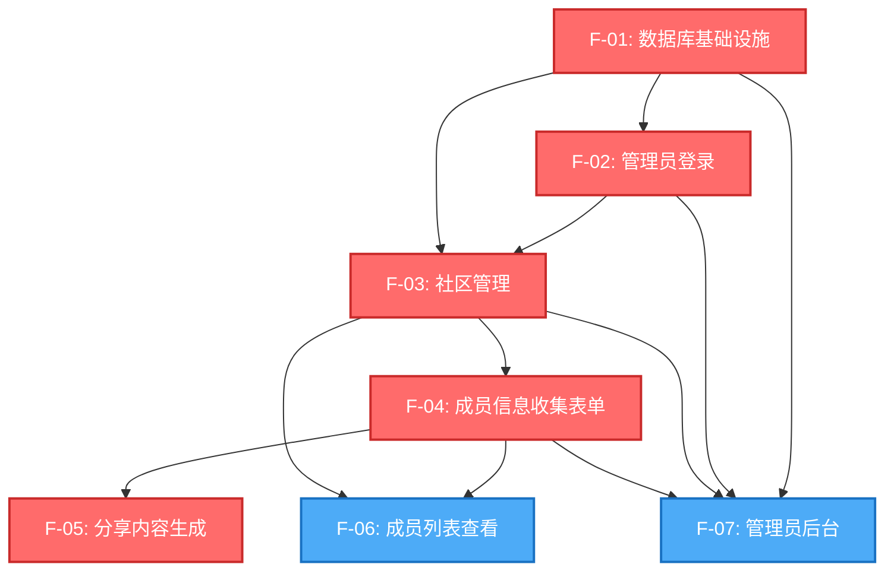

# 微信群成员介绍 - 规格说明

**版本**: 1.0
**最后更新**: 2025-12-04
**方法论**: Spec-Driven Development (SDD)

---

## 导航指南

### 给 AI 编程助手

**在编写任何代码之前，从这里开始：**

1. **理解系统架构** → 阅读 [system/S-00-architecture.md](./system/S-00-architecture.md)
2. **查看系统设计** → 浏览 [system/](#系统设计) 目录
3. **选择功能实现** → 探索 [features/](#功能规格) 目录
4. **遵循模板** → 使用 [features/TEMPLATE.md](./features/TEMPLATE.md) 添加新功能

### 给开发者

**快速入门：**

- **这是什么产品？** → 查看 [产品概览](#产品概览)
- **如何组织？** → 查看 [目录结构](#目录结构)
- **从哪里开始？** → 查看 [阅读顺序](#阅读顺序)
- **实施计划是什么？** → 查看 [功能依赖关系图](#功能依赖关系图)

---

## 目录结构

```
specs/
├── README.md                           # 本文件 - 导航指南
│
├── system/                             # 系统设计（跨功能共享）
│   ├── S-00-architecture.md            # 系统架构概览
│   ├── S-01-uiux-design.md            # UI/UX 设计系统
│   ├── S-02-testing-strategy.md       # 测试策略
│   ├── S-03-database-schema.md        # 数据库设计
│   ├── S-04-authentication.md         # 认证系统
│   └── S-05-community-routing.md      # 多社区路由系统
│
├── features/                           # 功能规格
│   ├── TEMPLATE.md                     # 标准功能规格模板
│   ├── F-01-database-infra.md         # 数据库基础设施
│   ├── F-02-admin-login.md            # 管理员登录
│   ├── F-03-community-management.md   # 社区管理
│   ├── F-04-member-form.md            # 成员信息收集表单
│   ├── F-05-share-generation.md       # 分享内容生成
│   ├── F-06-member-list.md            # 成员列表查看
│   └── F-07-admin-panel.md            # 管理员后台
│
└── archive/                            # （如适用）原始文档
    └── ...
```

---

## 功能索引

### 完整功能目录（7个功能）

| 功能ID | 功能名称 | 优先级 | 依赖关系 | 状态 |
|--------|----------|--------|----------|------|
| **F-01** | [数据库基础设施](./features/F-01-database-infra.md) | CRITICAL | 无 | ✅ 规格完成 |
| **F-02** | [管理员登录](./features/F-02-admin-login.md) | CRITICAL | F-01 | ✅ 规格完成 |
| **F-03** | [社区管理](./features/F-03-community-management.md) | CRITICAL | F-01, F-02 | ✅ 规格完成 |
| **F-04** | [成员信息收集表单](./features/F-04-member-form.md) | CRITICAL | F-01, F-03 | ✅ 规格完成 |
| **F-05** | [分享内容生成](./features/F-05-share-generation.md) | CRITICAL | F-01, F-03, F-04 | ✅ 规格完成 |
| **F-06** | [成员列表查看](./features/F-06-member-list.md) | HIGH | F-01, F-03, F-04 | ✅ 规格完成 |
| **F-07** | [管理员后台](./features/F-07-admin-panel.md) | HIGH | F-01, F-02, F-03, F-04 | ✅ 规格完成 |

---

## 功能依赖关系图



### 实施波次

**Wave 1**（无依赖）：
- F-01: 数据库基础设施

**Wave 2**（依赖 Wave 1）：
- F-02: 管理员登录

**Wave 3**（依赖 Wave 1-2）：
- F-03: 社区管理

**Wave 4**（依赖 Wave 1-3）：
- F-04: 成员信息收集表单
- F-06: 成员列表查看

**Wave 5**（依赖 Wave 1-4）：
- F-05: 分享内容生成
- F-07: 管理员后台

---

## 阅读顺序

### 实施指南（AI 助手和开发者）

**1. 从架构开始**
阅读 [system/S-00-architecture.md](./system/S-00-architecture.md) 理解系统级视图。

**2. 查看系统设计**（按此顺序）：
- [system/S-01-uiux-design.md](./system/S-01-uiux-design.md) - UI/UX 设计系统
- [system/S-02-testing-strategy.md](./system/S-02-testing-strategy.md) - 测试策略
- [system/S-03-database-schema.md](./system/S-03-database-schema.md) - 数据库设计
- [system/S-04-authentication.md](./system/S-04-authentication.md) - 认证系统
- [system/S-05-community-routing.md](./system/S-05-community-routing.md) - 多社区路由

**3. 选择功能实现**
每个功能都有完整规格：
- **从这里开始**: [F-01: 数据库基础设施](./features/F-01-database-infra.md)
- **然后实现**: F-02, F-03（Wave 2-3）
- **按波次进行**: 查看 [实施波次](#实施波次)

**4. 遵循模板**
添加新功能时，复制 [features/TEMPLATE.md](./features/TEMPLATE.md)

---

## 产品概览

**问题**：
微信群成员介绍信息散乱、缺乏规范，后进群的成员无法查看历史介绍，不便于管理和长期分享。

**解决方案**：
提供移动优先的 Web 应用，支持：
- 结构化收集成员介绍信息（姓名、所在地、职业等）
- 生成格式化文字，方便复制到微信群
- 为每个社区提供独立的成员列表页面（公开访问）
- 管理员后台统一管理多个社区

**目标用户**：
社区管理者和参与者

**使用场景**：
线上社区收集成员信息并发布分享

---

## 系统设计

### [system/S-00-architecture.md](./system/S-00-architecture.md)
**作用**: 系统架构概览
**关键概念**: 多社区架构、默认技术栈（Supabase + Prisma + Next.js）

### [system/S-01-uiux-design.md](./system/S-01-uiux-design.md)
**作用**: UI/UX 设计系统
**关键概念**: 移动优先、现代简约风格（参考 solopreneur.global）、响应式设计

### [system/S-02-testing-strategy.md](./system/S-02-testing-strategy.md)
**作用**: 测试策略
**关键概念**: E2E 测试、集成测试、单元测试、Tier 1 关键路径测试

### [system/S-03-database-schema.md](./system/S-03-database-schema.md)
**作用**: 数据库设计
**关键概念**: Supabase PostgreSQL、Prisma ORM、communities 表、members 表

### [system/S-04-authentication.md](./system/S-04-authentication.md)
**作用**: 认证系统
**关键概念**: 管理员配置文件静态登录、普通用户免登录、环境变量凭证

### [system/S-05-community-routing.md](./system/S-05-community-routing.md)
**作用**: 多社区路由系统
**关键概念**: 独立链接生成、社区 slug、Next.js 动态路由

---

## 技术栈

**前端**: Next.js 14 + React 18 + Tailwind CSS
**后端**: Next.js API Routes + Prisma ORM
**数据库**: Supabase (PostgreSQL)
**认证**: 管理员配置文件静态登录
**测试**: Playwright (E2E) + Jest (Unit)
**部署**: 待定（未来确定）

**查看 [system/S-00-architecture.md](./system/S-00-architecture.md) 了解完整技术栈详情。**

---

## 快速链接

### 系统文档
- [S-00: 系统架构](./system/S-00-architecture.md)
- [S-01: UI/UX 设计系统](./system/S-01-uiux-design.md)
- [S-02: 测试策略](./system/S-02-testing-strategy.md)
- [S-03: 数据库设计](./system/S-03-database-schema.md)
- [S-04: 认证系统](./system/S-04-authentication.md)
- [S-05: 多社区路由系统](./system/S-05-community-routing.md)

### 所有功能
- [F-01: 数据库基础设施](./features/F-01-database-infra.md)
- [F-02: 管理员登录](./features/F-02-admin-login.md)
- [F-03: 社区管理](./features/F-03-community-management.md)
- [F-04: 成员信息收集表单](./features/F-04-member-form.md)
- [F-05: 分享内容生成](./features/F-05-share-generation.md)
- [F-06: 成员列表查看](./features/F-06-member-list.md)
- [F-07: 管理员后台](./features/F-07-admin-panel.md)

### 模板
- [功能模板](./features/TEMPLATE.md)

---

**方法论**: Spec-Driven Development (SDD)
**状态**: ✅ 所有规格已文档化
**总功能数**: 7
**最后更新**: 2025-12-04
