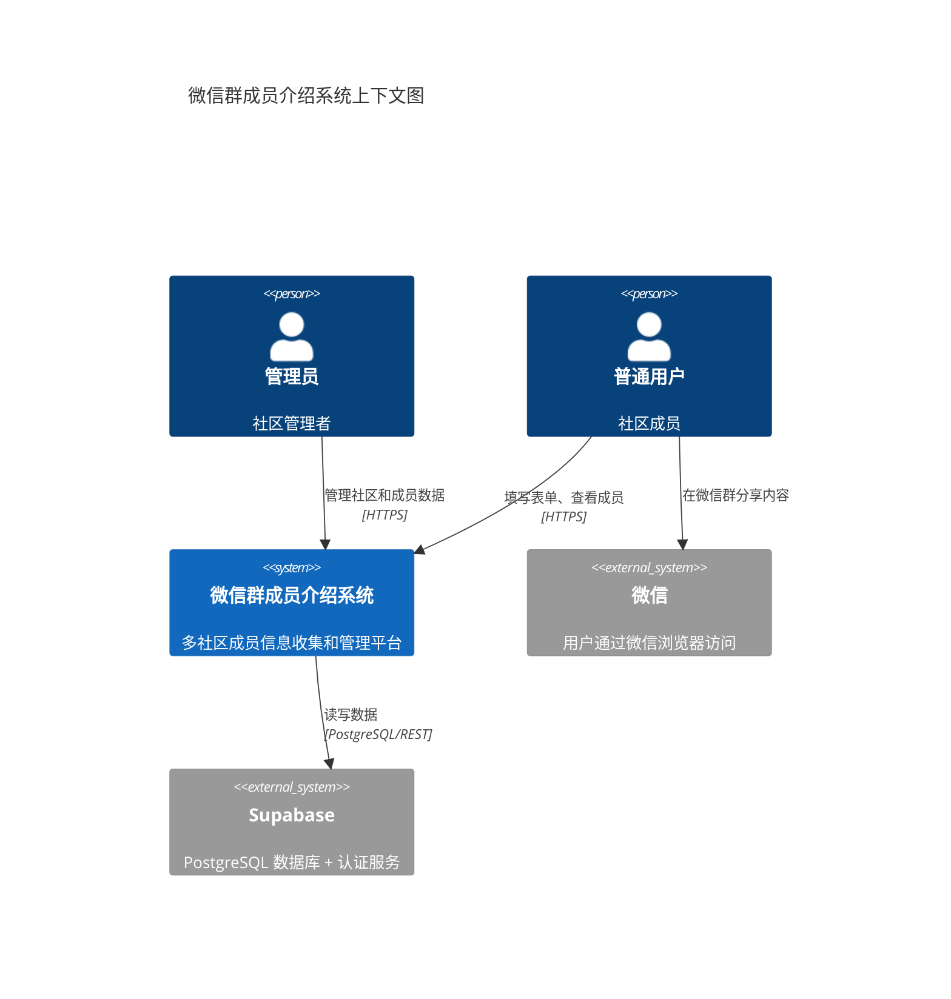
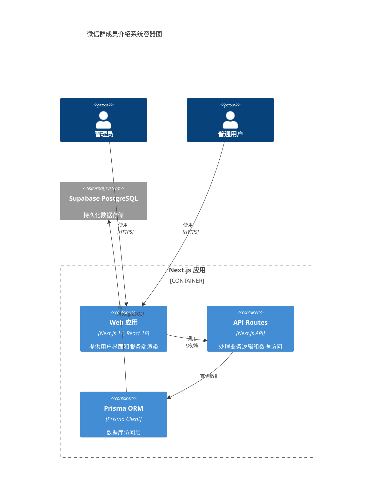
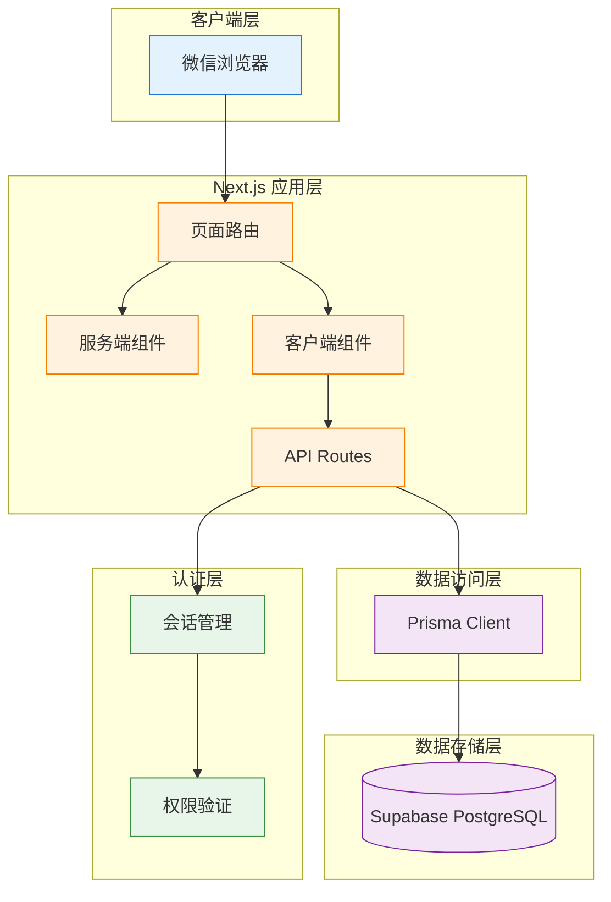
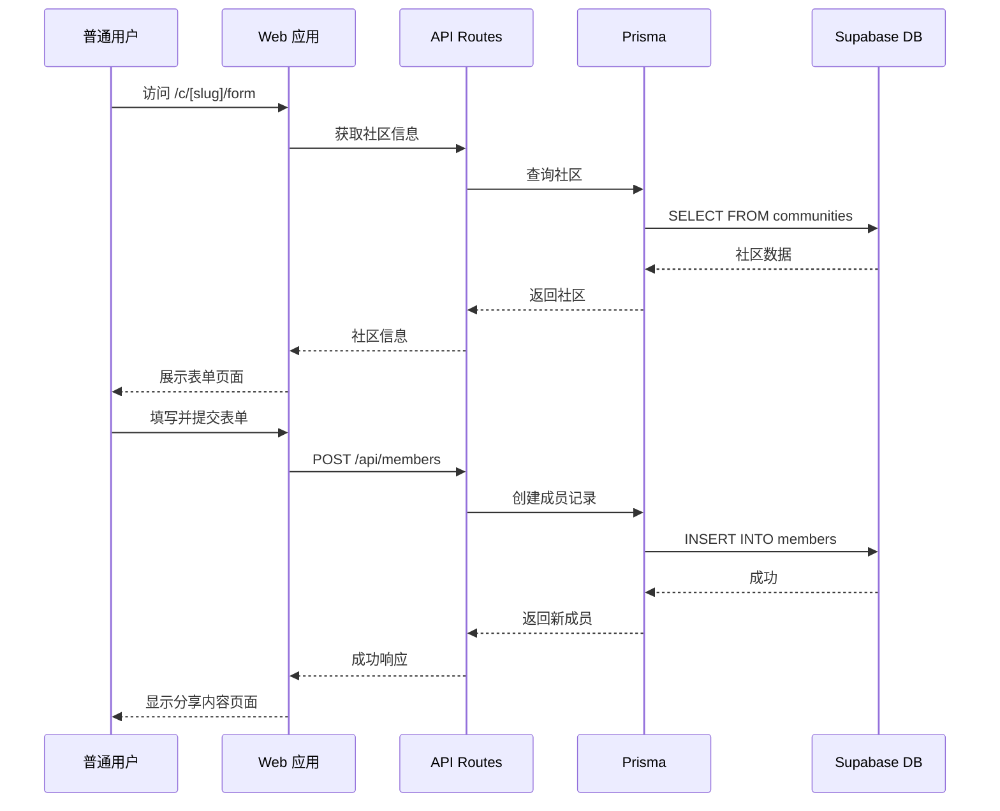
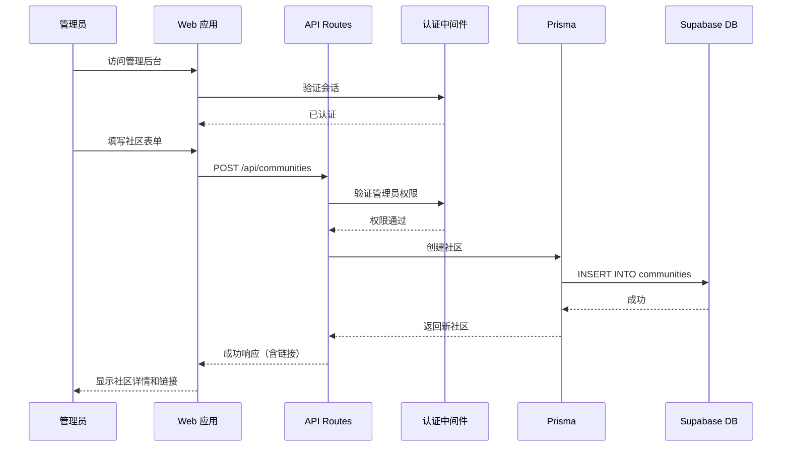
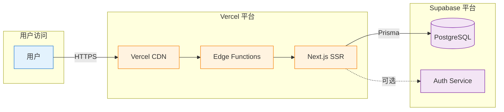

# S-00: 系统架构概览

**Version**: 1.0
**Last Updated**: 2025-12-04
**Status**: ✅ Spec Complete

---

## Quick Reference

**Purpose**: 微信群成员介绍项目的系统架构设计和技术栈定义，支持多社区成员信息收集和管理。

**Dependencies**:
- 无（基础架构文档）

**Used By**:
- S-01: UI/UX 设计系统
- S-02: 测试策略
- S-03: 数据库设计
- S-04: 认证系统
- S-05: 多社区路由系统
- F-01 到 F-07: 所有功能模块

---

## 系统概述

微信群成员介绍是一个多社区成员信息收集和管理的移动 Web 应用。系统允许管理员创建和管理多个社区，每个社区拥有独立的成员信息收集表单和展示页面。普通用户无需登录即可填写表单和查看成员列表。

### 核心价值

- **多社区架构**: 支持管理员创建和管理多个独立社区
- **低门槛**: 普通用户无需注册即可参与
- **移动优先**: 针对微信浏览器优化的用户体验
- **结构化数据**: 规范化的成员信息收集和展示
- **便捷分享**: 一键生成可复制的分享内容

### 用户角色

1. **管理员**:
   - 创建和管理社区
   - 查看和管理所有社区的成员数据
   - 生成表单链接和分享链接

2. **普通用户**:
   - 填写成员信息表单（免登录）
   - 查看社区成员列表（免登录）
   - 复制分享内容到微信群

---

## 架构图

### C4 系统上下文图



### C4 容器图



### 系统组件图



---

## 技术栈详情

### 前端技术

| 技术 | 版本 | 用途 |
|------|------|------|
| **Next.js** | 14.x | React 框架，提供 SSR、路由、API Routes |
| **React** | 18.x | UI 组件库 |
| **Tailwind CSS** | 3.x | 原子化 CSS 框架 |
| **TypeScript** | 5.x | 类型安全的开发体验 |

### 后端技术

| 技术 | 版本 | 用途 |
|------|------|------|
| **Next.js API Routes** | 14.x | 服务端 API 接口 |
| **Prisma** | 5.x | TypeScript ORM，数据库访问 |
| **Supabase** | Latest | PostgreSQL 数据库 + 认证服务 |

### 开发和测试工具

| 技术 | 版本 | 用途 |
|------|------|------|
| **Playwright** | Latest | E2E 测试框架 |
| **Jest** | Latest | 单元测试和集成测试 |
| **ESLint** | Latest | 代码质量检查 |
| **Prettier** | Latest | 代码格式化 |

### 部署平台

| 平台 | 用途 |
|------|------|
| **Vercel** | Next.js 应用托管（推荐） |
| **Supabase** | PostgreSQL 数据库托管 |

---

## 系统模块概览

### 强制性基础模块

#### S-01: UI/UX 设计系统
- **目的**: 定义视觉语言和用户体验标准
- **内容**: 配色方案、字体系统、组件库、响应式设计、可访问性
- **设计风格**: 参考 solopreneur.global（现代简约、蓝色调、温和圆角）

#### S-02: 测试策略
- **目的**: 定义测试金字塔和质量保证流程
- **内容**: Tier 1 关键路径测试、E2E/Integration/Unit 测试策略、覆盖率目标
- **工具**: Playwright + Jest

### 项目特定模块

#### S-03: 数据库设计
- **目的**: 定义数据模型和持久化策略
- **内容**: Prisma schema（communities + members 表）、索引优化、RLS 策略
- **依赖**: Supabase PostgreSQL

#### S-04: 认证系统
- **目的**: 定义用户认证和权限管理
- **内容**: 管理员静态登录（.env 配置）、会话管理、权限验证
- **特点**: 普通用户免登录，管理员使用环境变量配置

#### S-05: 多社区路由系统
- **目的**: 定义社区路由和链接生成策略
- **内容**: Next.js 动态路由、链接生成、社区 slug 管理、二维码生成
- **路由模式**: `/c/[slug]/form` 和 `/c/[slug]/list`

---

## 设计原则

### 1. 移动优先（Mobile First）

系统主要面向微信浏览器用户，所有设计和开发以移动端为优先级：

- 响应式布局，移动端体验优于桌面端
- 触摸友好的交互元素（最小 44x44px 触摸区域）
- 快速加载和流畅的页面切换
- 适配微信浏览器的特殊行为和限制

### 2. 数据隔离（Data Isolation）

多社区架构确保数据安全和隐私：

- 每个社区的成员数据独立存储（通过 `community_id` 关联）
- 数据库层级的外键约束和级联删除
- API 层级的社区 ID 验证
- 防止跨社区数据泄露

### 3. 低门槛参与（Low Barrier）

降低用户参与成本：

- 普通用户无需注册或登录
- 表单填写流程简洁明了
- 一键复制分享内容
- 清晰的视觉引导

### 4. 管理员友好（Admin Friendly）

简化管理员操作流程：

- 静态登录，无需复杂的用户管理系统
- 直观的社区管理界面
- 一键生成表单链接和分享链接
- 集中化的成员数据管理

### 5. 可维护性（Maintainability）

采用现代化、AI 友好的技术栈：

- TypeScript 提供类型安全
- Prisma ORM 提供清晰的数据访问接口
- 模块化的代码结构
- 完整的测试覆盖

### 6. 性能优化（Performance）

确保快速响应和流畅体验：

- Next.js SSR 提高首屏加载速度
- 数据库索引优化查询性能
- 静态资源 CDN 分发
- 前端状态管理优化

### 7. 可扩展性（Scalability）

为未来功能预留扩展空间：

- 清晰的模块边界
- RESTful API 设计
- 数据库 schema 版本管理
- 配置化的功能开关

---

## 数据流设计

### 用户填写表单流程



### 管理员创建社区流程



---

## 部署架构

### Vercel + Supabase 部署方案



### 环境配置

**开发环境 (.env.local)**:
```env
# Supabase
DATABASE_URL="postgresql://..."
DIRECT_URL="postgresql://..."

# 管理员凭证
ADMIN_USERNAME="admin"
ADMIN_PASSWORD_HASH="<bcrypt_hash>"

# Next.js
NEXT_PUBLIC_APP_URL="http://localhost:3000"
```

**生产环境 (Vercel Environment Variables)**:
- 所有配置通过 Vercel Dashboard 配置
- 敏感信息（数据库连接、管理员密码）加密存储
- 自动 HTTPS 和 CDN 加速

---

## 安全考虑

### 1. 认证和授权

- 管理员密码使用 bcrypt 哈希存储
- 会话使用 HTTP-only cookies
- API 路由验证管理员权限
- 防止 CSRF 攻击

### 2. 数据验证

- 前端和后端双重数据验证
- Prisma schema 类型约束
- 防止 SQL 注入（Prisma 参数化查询）
- XSS 防护（React 自动转义）

### 3. 访问控制

- 普通用户仅能访问公开路由
- 管理员路由需要认证
- 数据库 RLS 策略（可选）
- 防止暴力破解（登录限流）

### 4. 数据隐私

- 社区间数据隔离
- 敏感信息加密传输（HTTPS）
- 遵守数据最小化原则
- 用户数据可删除

---

## 性能目标

### 加载性能

| 指标 | 目标 | 说明 |
|------|------|------|
| **首屏加载时间** | < 2 秒 | 移动 4G 网络 |
| **交互可用时间** | < 3 秒 | Time to Interactive |
| **Lighthouse 性能分** | > 90 | 移动端评分 |

### 数据库性能

| 操作 | 目标 | 说明 |
|------|------|------|
| **成员列表查询** | < 200ms | 单社区 100 条数据 |
| **表单提交** | < 500ms | 包括数据验证 |
| **社区创建** | < 300ms | 管理员操作 |

### 并发性能

| 场景 | 目标 |
|------|------|
| **同时在线用户** | 1000+ |
| **表单提交 QPS** | 100+ |

---

## 可扩展性设计

### 未来功能预留

1. **社区功能增强**
   - 社区分类和标签
   - 社区公告和置顶
   - 社区统计数据

2. **成员功能扩展**
   - 成员头像上传
   - 成员动态时间线
   - 成员搜索和筛选

3. **分享功能优化**
   - 自定义分享模板
   - 成员卡片图片生成
   - 二维码自动生成

4. **管理功能完善**
   - 批量导入/导出
   - 数据统计和可视化
   - 操作日志记录

---

## Related Documents

### 系统设计模块
- [S-01: UI/UX 设计系统](./S-01-uiux-design.md)
- [S-02: 测试策略](./S-02-testing-strategy.md)
- [S-03: 数据库设计](./S-03-database-schema.md)
- [S-04: 认证系统](./S-04-authentication.md)
- [S-05: 多社区路由系统](./S-05-community-routing.md)

### 功能模块
- [F-01: 数据库基础设施](../features/F-01-database-infra.md)
- [F-02: 管理员登录](../features/F-02-admin-login.md)
- [F-03: 社区管理](../features/F-03-community-management.md)

---

## Notes

### 技术选型说明

本项目采用 SDD 推荐的默认技术栈，优势如下：

1. **Next.js 14**:
   - 提供 SSR 提升首屏加载速度
   - App Router 简化路由管理
   - API Routes 无需独立后端

2. **Prisma ORM**:
   - TypeScript 原生支持
   - 类型安全的数据库访问
   - 优秀的迁移工具

3. **Supabase**:
   - 一体化解决方案（数据库 + 认证 + 存储）
   - 免费额度适合 MVP
   - 与 Prisma 集成良好

4. **Tailwind CSS**:
   - 快速原型开发
   - 一致的设计系统
   - 优秀的移动端支持

### 架构决策记录

1. **为什么选择多社区架构？**
   - 支持多个微信群使用同一套系统
   - 数据隔离保证隐私安全
   - 管理员集中管理降低维护成本

2. **为什么选择静态登录？**
   - 简化认证流程，降低开发成本
   - 单管理员场景无需复杂用户系统
   - 通过环境变量配置保证安全

3. **为什么普通用户免登录？**
   - 降低参与门槛，提高填写率
   - 微信群场景下注册流程复杂
   - 数据公开展示无需严格权限控制
