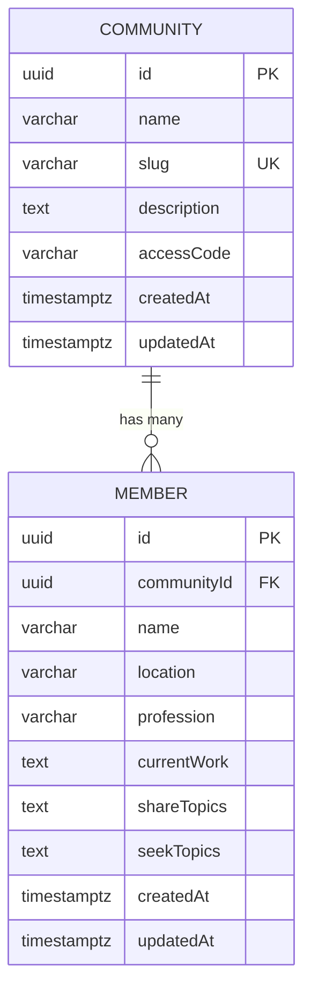

# S-03: 数据库设计

**Version**: 1.0
**Last Updated**: 2025-12-04
**Status**: ✅ Spec Complete

---

## Quick Reference

**Purpose**: 定义社区成员名录项目的数据库模型、Prisma schema、索引优化和数据迁移策略。

**Dependencies**:
- S-00: 系统架构概览
- Supabase PostgreSQL

**Used By**:
- F-01: 数据库基础设施
- F-03: 社区管理
- F-04: 成员信息收集表单
- F-06: 成员列表查看
- F-07: 管理员后台

---

## Dependencies

### Required System Modules
- [S-00: 系统架构概览](./S-00-architecture.md) - 了解系统整体架构和技术栈

### External Services
- **Supabase PostgreSQL** - 托管 PostgreSQL 数据库
- **Prisma ORM** - TypeScript ORM，数据库访问层

### Infrastructure Requirements
- PostgreSQL 15+
- Prisma 5.x
- Node.js 18+

---

## 数据库概览

### 数据库架构设计

本项目采用 **多社区（Multi-Tenancy）** 架构，核心数据模型包括：

1. **communities 表**: 存储社区基础信息
2. **members 表**: 存储成员信息，通过 `communityId` 关联到社区

### 设计原则

1. **数据隔离**: 每个社区的成员数据通过外键关联，确保数据隔离
2. **级联删除**: 删除社区时自动删除关联的成员数据
3. **索引优化**: 为常用查询字段创建索引，提高查询性能
4. **类型安全**: 使用 Prisma Schema 定义严格的数据类型
5. **可扩展性**: 预留字段扩展空间，支持未来功能

---

## Prisma Schema 定义

### 完整 Schema

**文件路径**: `prisma/schema.prisma`

```prisma
// prisma/schema.prisma

generator client {
  provider = "prisma-client-js"
}

datasource db {
  provider = "postgresql"
  url      = env("DATABASE_URL")
  directUrl = env("DIRECT_URL")
}

// ============================================
// 社区表（Communities）
// ============================================

model Community {
  id          String   @id @default(uuid())
  name        String   @db.VarChar(100)
  slug        String   @unique @db.VarChar(100)
  description String?  @db.Text
  accessCode  String?  @db.VarChar(50) @map("access_code")
  createdAt   DateTime @default(now()) @map("created_at")
  updatedAt   DateTime @updatedAt @map("updated_at")

  // 关联关系
  members Member[]

  @@map("communities")
}

// ============================================
// 成员表（Members）
// ============================================

model Member {
  id             String    @id @default(uuid())
  communityId    String    @map("community_id")

  // 必填字段
  name           String    @db.VarChar(100)
  location       String    @db.VarChar(100)
  profession     String    @db.VarChar(100)

  // 选填字段
  currentWork    String?   @map("current_work") @db.Text
  shareTopics    String?   @map("share_topics") @db.Text
  seekTopics     String?   @map("seek_topics") @db.Text

  createdAt      DateTime  @default(now()) @map("created_at")
  updatedAt      DateTime  @updatedAt @map("updated_at")

  // 关联关系
  community Community @relation(fields: [communityId], references: [id], onDelete: Cascade)

  // 索引
  @@index([communityId])
  @@index([createdAt])
  @@map("members")
}
```

---

## 数据表详解

### communities 表

**用途**: 存储社区的基础信息

| 字段名 | 类型 | 约束 | 说明 |
|--------|------|------|------|
| `id` | UUID | PRIMARY KEY | 社区唯一标识符 |
| `name` | VARCHAR(100) | NOT NULL | 社区名称（如"产品经理社区"） |
| `slug` | VARCHAR(100) | UNIQUE, NOT NULL | URL 友好的唯一标识符（如"pm-community"） |
| `description` | TEXT | NULLABLE | 社区描述（可选） |
| `accessCode` | VARCHAR(50) | NULLABLE | 访问码（可选，为空表示公开访问） |
| `createdAt` | TIMESTAMPTZ | DEFAULT now() | 创建时间 |
| `updatedAt` | TIMESTAMPTZ | AUTO UPDATE | 更新时间 |

**索引**:
- `PRIMARY KEY (id)`: 主键索引
- `UNIQUE (slug)`: 唯一索引，确保 slug 不重复

**关联关系**:
- `members`: 一对多关系（一个社区有多个成员）

**数据库设计要点**:
- `accessCode` 为可选字段，为空或 null 表示公开访问，无需验证
- `accessCode` 不为空时，用户需要输入正确的访问码才能查看成员列表
- 推荐格式：6位大小写字母数字混合（如 "aB3xY9"）
- 可由管理员手动填写或系统自动生成

**示例数据**:
```json
{
  "id": "550e8400-e29b-41d4-a716-446655440000",
  "name": "产品经理社区",
  "slug": "pm-community",
  "description": "专注产品设计和用户体验的社区",
  "accessCode": "aB3xY9",
  "createdAt": "2025-12-04T10:00:00Z",
  "updatedAt": "2025-12-04T10:00:00Z"
}
```

---

### members 表

**用途**: 存储社区成员的信息

| 字段名 | 类型 | 约束 | 说明 |
|--------|------|------|------|
| `id` | UUID | PRIMARY KEY | 成员唯一标识符 |
| `communityId` | UUID | FOREIGN KEY, NOT NULL | 关联的社区 ID |
| `name` | VARCHAR(100) | NOT NULL | 成员姓名 |
| `location` | VARCHAR(100) | NOT NULL | 所在地（如"北京"） |
| `profession` | VARCHAR(100) | NOT NULL | 职业/行业（如"产品经理"） |
| `currentWork` | TEXT | NULLABLE | 正在做的事情（选填） |
| `shareTopics` | TEXT | NULLABLE | 希望分享的内容（选填） |
| `seekTopics` | TEXT | NULLABLE | 希望收获的内容（选填） |
| `createdAt` | TIMESTAMPTZ | DEFAULT now() | 创建时间 |
| `updatedAt` | TIMESTAMPTZ | AUTO UPDATE | 更新时间 |

**索引**:
- `PRIMARY KEY (id)`: 主键索引
- `INDEX (communityId)`: 外键索引，优化按社区查询
- `INDEX (createdAt)`: 时间索引，优化按时间排序查询

**外键约束**:
- `FOREIGN KEY (communityId) REFERENCES communities(id) ON DELETE CASCADE`
  - 删除社区时，自动删除该社区的所有成员

**关联关系**:
- `community`: 多对一关系（多个成员属于一个社区）

**示例数据**:
```json
{
  "id": "660e8400-e29b-41d4-a716-446655440001",
  "communityId": "550e8400-e29b-41d4-a716-446655440000",
  "name": "张三",
  "location": "北京",
  "profession": "产品经理",
  "currentWork": "正在开发一个 SaaS 产品",
  "shareTopics": "产品设计经验和用户研究方法",
  "seekTopics": "技术实现和团队管理经验",
  "createdAt": "2025-12-04T11:00:00Z",
  "updatedAt": "2025-12-04T11:00:00Z"
}
```

---

## 数据关系图



---

## 索引优化策略

### 已创建索引

| 表名 | 索引字段 | 索引类型 | 用途 |
|------|----------|---------|------|
| `communities` | `id` | PRIMARY KEY | 主键查询 |
| `communities` | `slug` | UNIQUE | URL 路由查询 |
| `members` | `id` | PRIMARY KEY | 主键查询 |
| `members` | `communityId` | INDEX | 按社区查询成员列表 |
| `members` | `createdAt` | INDEX | 按时间排序成员列表 |

### 查询性能优化

**场景 1: 查询社区所有成员（按创建时间倒序）**

```sql
SELECT * FROM members
WHERE community_id = '550e8400-e29b-41d4-a716-446655440000'
ORDER BY created_at DESC
LIMIT 50;
```

**优化**: 使用 `communityId` 和 `createdAt` 的组合索引

```prisma
@@index([communityId, createdAt])
```

**场景 2: 按社区 slug 查询社区**

```sql
SELECT * FROM communities WHERE slug = 'pm-community';
```

**优化**: `slug` 字段已创建 UNIQUE 索引，查询高效

---

## 数据迁移策略

### 初始化数据库

**步骤 1: 创建 Prisma 迁移**

```bash
# 创建迁移文件
npx prisma migrate dev --name init

# 生成 Prisma Client
npx prisma generate
```

**步骤 2: 应用迁移到生产环境**

```bash
# 部署迁移（生产环境）
npx prisma migrate deploy
```

### 迁移文件管理

**迁移目录结构**:
```
prisma/
├── schema.prisma
└── migrations/
    ├── 20251204000001_init/
    │   └── migration.sql
    └── migration_lock.toml
```

**初始迁移 SQL** (`20251204000001_init/migration.sql`):
```sql
-- CreateTable
CREATE TABLE "communities" (
    "id" TEXT NOT NULL,
    "name" VARCHAR(100) NOT NULL,
    "slug" VARCHAR(100) NOT NULL,
    "description" TEXT,
    "access_code" VARCHAR(50),
    "created_at" TIMESTAMP(3) NOT NULL DEFAULT CURRENT_TIMESTAMP,
    "updated_at" TIMESTAMP(3) NOT NULL,

    CONSTRAINT "communities_pkey" PRIMARY KEY ("id")
);

-- CreateTable
CREATE TABLE "members" (
    "id" TEXT NOT NULL,
    "community_id" TEXT NOT NULL,
    "name" VARCHAR(100) NOT NULL,
    "location" VARCHAR(100) NOT NULL,
    "profession" VARCHAR(100) NOT NULL,
    "current_work" TEXT,
    "share_topics" TEXT,
    "seek_topics" TEXT,
    "created_at" TIMESTAMP(3) NOT NULL DEFAULT CURRENT_TIMESTAMP,
    "updated_at" TIMESTAMP(3) NOT NULL,

    CONSTRAINT "members_pkey" PRIMARY KEY ("id")
);

-- CreateIndex
CREATE UNIQUE INDEX "communities_slug_key" ON "communities"("slug");

-- CreateIndex
CREATE INDEX "members_community_id_idx" ON "members"("community_id");

-- CreateIndex
CREATE INDEX "members_created_at_idx" ON "members"("created_at");

-- AddForeignKey
ALTER TABLE "members" ADD CONSTRAINT "members_community_id_fkey"
  FOREIGN KEY ("community_id") REFERENCES "communities"("id")
  ON DELETE CASCADE ON UPDATE CASCADE;
```

### 数据迁移最佳实践

1. **始终在开发环境测试迁移**
   ```bash
   npx prisma migrate dev --name <migration_name>
   ```

2. **生产环境使用 deploy 命令**
   ```bash
   npx prisma migrate deploy
   ```

3. **迁移前备份数据库**
   ```bash
   pg_dump wechat_intro_prod > backup_$(date +%Y%m%d).sql
   ```

4. **使用迁移锁防止并发迁移**
   - Prisma 自动管理 `migration_lock.toml`

5. **回滚策略**
   - 手动编写回滚 SQL
   - 测试回滚脚本

---

## RLS 策略（可选）

### Row-Level Security 概述

虽然本项目使用 Prisma ORM 在应用层控制访问权限，但也可以在数据库层启用 RLS（Row-Level Security）作为额外安全层。

### 社区数据隔离策略

**启用 RLS**:
```sql
-- 启用 RLS
ALTER TABLE communities ENABLE ROW LEVEL SECURITY;
ALTER TABLE members ENABLE ROW LEVEL SECURITY;

-- 管理员可以访问所有数据（应用层验证）
CREATE POLICY "管理员可以访问所有社区"
  ON communities FOR ALL
  USING (true);

CREATE POLICY "管理员可以访问所有成员"
  ON members FOR ALL
  USING (true);
```

**注意**: 由于本项目使用管理员静态登录（.env 配置），RLS 策略主要作为额外防护层。实际访问控制在应用层（API Routes）实现。

---

## 数据验证规则

### 应用层验证

使用 Zod 或 Joi 进行数据验证：

**成员数据验证 Schema**:
```typescript
// lib/validation/member.ts
import { z } from 'zod';

export const memberSchema = z.object({
  communityId: z.string().uuid('无效的社区 ID'),

  // 必填字段
  name: z.string()
    .min(2, '姓名至少 2 个字符')
    .max(100, '姓名最多 100 个字符'),

  location: z.string()
    .min(2, '所在地至少 2 个字符')
    .max(100, '所在地最多 100 个字符'),

  profession: z.string()
    .min(2, '职业/行业至少 2 个字符')
    .max(100, '职业/行业最多 100 个字符'),

  // 选填字段
  currentWork: z.string()
    .max(1000, '正在做的事情最多 1000 个字符')
    .nullable()
    .optional(),

  shareTopics: z.string()
    .max(1000, '希望分享的内容最多 1000 个字符')
    .nullable()
    .optional(),

  seekTopics: z.string()
    .max(1000, '希望收获的内容最多 1000 个字符')
    .nullable()
    .optional(),
});

export type MemberInput = z.infer<typeof memberSchema>;
```

**社区数据验证 Schema**:
```typescript
// lib/validation/community.ts
import { z } from 'zod';

export const communitySchema = z.object({
  name: z.string()
    .min(2, '社区名称至少 2 个字符')
    .max(100, '社区名称最多 100 个字符'),

  slug: z.string()
    .min(2, 'Slug 至少 2 个字符')
    .max(100, 'Slug 最多 100 个字符')
    .regex(/^[a-z0-9-]+$/, 'Slug 只能包含小写字母、数字和连字符'),

  description: z.string()
    .max(500, '描述最多 500 个字符')
    .nullable()
    .optional(),

  accessCode: z.string()
    .min(6, '访问码至少 6 个字符')
    .max(50, '访问码最多 50 个字符')
    .regex(/^[a-zA-Z0-9]+$/, '访问码只能包含字母和数字')
    .nullable()
    .optional(),
});

export type CommunityInput = z.infer<typeof communitySchema>;
```

---

## Prisma Client 使用示例

### 初始化 Prisma Client

**文件路径**: `lib/prisma.ts`

```typescript
// lib/prisma.ts
import { PrismaClient } from '@prisma/client';

const globalForPrisma = globalThis as unknown as {
  prisma: PrismaClient | undefined;
};

export const prisma =
  globalForPrisma.prisma ??
  new PrismaClient({
    log: process.env.NODE_ENV === 'development' ? ['query', 'error', 'warn'] : ['error'],
  });

if (process.env.NODE_ENV !== 'production') {
  globalForPrisma.prisma = prisma;
}
```

### 常用查询示例

**创建社区**:
```typescript
const community = await prisma.community.create({
  data: {
    name: '产品经理社区',
    slug: 'pm-community',
    description: '专注产品设计和用户体验',
    accessCode: 'aB3xY9', // 可选，为 null 表示公开访问
  },
});
```

**查询社区（按 slug）**:
```typescript
const community = await prisma.community.findUnique({
  where: { slug: 'pm-community' },
  include: {
    members: {
      orderBy: { createdAt: 'desc' },
      take: 50,
    },
  },
});
```

**创建成员**:
```typescript
const member = await prisma.member.create({
  data: {
    communityId: community.id,
    name: '张三',
    location: '北京',
    profession: '产品经理',
    currentWork: '正在开发 SaaS 产品',
    shareTopics: '产品设计经验',
    seekTopics: '技术实现经验',
  },
});
```

**查询社区的所有成员**:
```typescript
const members = await prisma.member.findMany({
  where: { communityId: community.id },
  orderBy: { createdAt: 'desc' },
  take: 50,
  skip: 0,
});
```

**删除社区（级联删除成员）**:
```typescript
await prisma.community.delete({
  where: { id: community.id },
});
// 关联的 members 会自动删除（ON DELETE CASCADE）
```

**统计社区成员数量**:
```typescript
const count = await prisma.member.count({
  where: { communityId: community.id },
});
```

---

## 数据备份和恢复

### 自动备份策略

**Supabase 自动备份**:
- Supabase 提供每日自动备份（保留 7 天）
- 升级到付费计划可获得更长保留期和时间点恢复（PITR）

### 手动备份

**使用 pg_dump 备份**:
```bash
# 导出整个数据库
pg_dump $DATABASE_URL > backup_$(date +%Y%m%d_%H%M%S).sql

# 仅导出 schema
pg_dump --schema-only $DATABASE_URL > schema_backup.sql

# 仅导出数据
pg_dump --data-only $DATABASE_URL > data_backup.sql
```

**恢复数据库**:
```bash
psql $DATABASE_URL < backup_20251204_120000.sql
```

---

## Related Documents

### 系统设计模块
- [S-00: 系统架构概览](./S-00-architecture.md)
- [S-04: 认证系统](./S-04-authentication.md)
- [S-05: 多社区路由系统](./S-05-community-routing.md)

### 功能模块
- [F-01: 数据库基础设施](../features/F-01-database-infra.md) - 实现数据库初始化
- [F-03: 社区管理](../features/F-03-community-management.md) - 使用 communities 表
- [F-04: 成员信息收集表单](../features/F-04-member-form.md) - 使用 members 表

---

## Notes

### Prisma 最佳实践

1. **使用 Prisma Migrate**
   - 开发环境: `npx prisma migrate dev`
   - 生产环境: `npx prisma migrate deploy`

2. **定期更新 Prisma Client**
   ```bash
   npx prisma generate
   ```

3. **使用 Prisma Studio 可视化数据**
   ```bash
   npx prisma studio
   ```

4. **优化查询性能**
   - 使用 `select` 仅查询需要的字段
   - 使用 `include` 合理加载关联数据
   - 避免 N+1 查询问题

### 数据库性能优化

1. **连接池管理**
   - Supabase 提供内置连接池
   - 使用 `DIRECT_URL` 用于迁移

2. **查询优化**
   - 为常用查询创建索引
   - 使用 `EXPLAIN ANALYZE` 分析慢查询

3. **数据库监控**
   - 使用 Supabase Dashboard 监控性能
   - 设置慢查询告警

### 未来扩展

可能的数据库扩展：

1. **成员头像**: 添加 `avatarUrl` 字段
2. **社区分类**: 添加 `category` 字段
3. **成员标签**: 创建 `tags` 表（多对多关系）
4. **操作日志**: 创建 `audit_logs` 表
