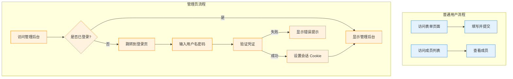

# S-04: 认证系统

**Version**: 1.0
**Last Updated**: 2025-12-04
**Status**: ✅ Spec Complete

---

## Quick Reference

**Purpose**: 定义微信群成员介绍项目的认证和授权机制，包括管理员静态登录和普通用户免登录访问。

**Dependencies**:
- S-00: 系统架构概览
- S-03: 数据库设计

**Used By**:
- F-02: 管理员登录
- F-03: 社区管理
- F-07: 管理员后台
- 所有需要权限验证的功能

---

## Dependencies

### Required System Modules
- [S-00: 系统架构概览](./S-00-architecture.md) - 了解系统整体架构
- [S-03: 数据库设计](./S-03-database-schema.md) - 了解数据模型

### External Services
- **bcrypt** - 密码哈希库
- **jose** - JWT 签名和验证（轻量级，Next.js 推荐）
- **cookies-next** - Cookie 管理工具

### Infrastructure Requirements
- Next.js 14 + API Routes
- Node.js 18+
- 环境变量配置（.env）

---

## 认证架构概览

### 双层认证模型

本项目采用 **双层认证模型**：

1. **管理员层**:
   - 静态凭证存储在环境变量（.env）
   - 使用会话 Cookie 维持登录状态
   - 全部管理功能需要认证

2. **普通用户层**:
   - 完全免登录
   - 直接访问表单和成员列表
   - 无需任何认证流程

### 认证流程图



---

## 管理员静态登录

### 环境变量配置

**文件路径**: `.env.local` (开发环境) / Vercel Environment Variables (生产环境)

```env
# 管理员凭证
ADMIN_USERNAME="admin"
ADMIN_PASSWORD_HASH="$2b$10$..."  # bcrypt hash

# JWT 密钥（用于签名会话 token）
JWT_SECRET="your-secret-key-min-32-chars-long"
JWT_EXPIRES_IN="7d"
```

### 密码哈希生成

**生成 bcrypt hash**:

```typescript
// scripts/generate-password-hash.ts
import bcrypt from 'bcrypt';

async function generatePasswordHash(password: string) {
  const saltRounds = 10;
  const hash = await bcrypt.hash(password, saltRounds);
  console.log('Password Hash:', hash);
}

// 使用示例
generatePasswordHash('your-admin-password');
```

**运行脚本**:
```bash
npx ts-node scripts/generate-password-hash.ts
```

**输出示例**:
```
Password Hash: $2b$10$abcdefghijklmnopqrstuvwxyz1234567890ABCDEFGHIJKLMNOPQR
```

将生成的 hash 复制到 `.env.local` 的 `ADMIN_PASSWORD_HASH` 中。

---

## 会话管理

### JWT Token 结构

使用 JWT（JSON Web Token）存储会话信息：

**Payload 结构**:
```typescript
interface SessionPayload {
  username: string;
  role: 'admin';
  iat: number;  // Issued At (签发时间)
  exp: number;  // Expiration (过期时间)
}
```

### JWT 工具函数

**文件路径**: `lib/auth/jwt.ts`

```typescript
// lib/auth/jwt.ts
import { SignJWT, jwtVerify } from 'jose';

const JWT_SECRET = new TextEncoder().encode(
  process.env.JWT_SECRET || 'default-secret-min-32-chars'
);
const JWT_EXPIRES_IN = process.env.JWT_EXPIRES_IN || '7d';

export interface SessionPayload {
  username: string;
  role: 'admin';
}

/**
 * 生成 JWT Token
 */
export async function signToken(payload: SessionPayload): Promise<string> {
  return await new SignJWT(payload)
    .setProtectedHeader({ alg: 'HS256' })
    .setIssuedAt()
    .setExpirationTime(JWT_EXPIRES_IN)
    .sign(JWT_SECRET);
}

/**
 * 验证 JWT Token
 */
export async function verifyToken(token: string): Promise<SessionPayload | null> {
  try {
    const { payload } = await jwtVerify(token, JWT_SECRET);
    return payload as SessionPayload;
  } catch (error) {
    console.error('JWT verification failed:', error);
    return null;
  }
}

/**
 * 解码 JWT Token（不验证签名）
 */
export function decodeToken(token: string): SessionPayload | null {
  try {
    const parts = token.split('.');
    if (parts.length !== 3) return null;
    const payload = JSON.parse(Buffer.from(parts[1], 'base64').toString());
    return payload as SessionPayload;
  } catch {
    return null;
  }
}
```

### Cookie 管理

**文件路径**: `lib/auth/cookies.ts`

```typescript
// lib/auth/cookies.ts
import { cookies } from 'next/headers';

const SESSION_COOKIE_NAME = 'admin-session';

/**
 * 设置会话 Cookie
 */
export async function setSessionCookie(token: string) {
  const cookieStore = await cookies();

  cookieStore.set(SESSION_COOKIE_NAME, token, {
    httpOnly: true,      // 防止 XSS 攻击
    secure: process.env.NODE_ENV === 'production', // 生产环境使用 HTTPS
    sameSite: 'lax',     // 防止 CSRF 攻击
    maxAge: 60 * 60 * 24 * 7, // 7 天
    path: '/',
  });
}

/**
 * 获取会话 Cookie
 */
export async function getSessionCookie(): Promise<string | null> {
  const cookieStore = await cookies();
  const cookie = cookieStore.get(SESSION_COOKIE_NAME);
  return cookie?.value || null;
}

/**
 * 删除会话 Cookie
 */
export async function deleteSessionCookie() {
  const cookieStore = await cookies();
  cookieStore.delete(SESSION_COOKIE_NAME);
}
```

---

## 登录 API

### POST /api/auth/login

**文件路径**: `app/api/auth/login/route.ts`

```typescript
// app/api/auth/login/route.ts
import { NextRequest, NextResponse } from 'next/server';
import bcrypt from 'bcrypt';
import { z } from 'zod';
import { signToken } from '@/lib/auth/jwt';
import { setSessionCookie } from '@/lib/auth/cookies';

const loginSchema = z.object({
  username: z.string().min(1, '用户名不能为空'),
  password: z.string().min(1, '密码不能为空'),
});

export async function POST(request: NextRequest) {
  try {
    // 1. 验证请求体
    const body = await request.json();
    const result = loginSchema.safeParse(body);

    if (!result.success) {
      return NextResponse.json(
        { error: '请求参数无效', details: result.error.flatten() },
        { status: 400 }
      );
    }

    const { username, password } = result.data;

    // 2. 验证用户名
    const adminUsername = process.env.ADMIN_USERNAME;
    if (username !== adminUsername) {
      return NextResponse.json(
        { error: '用户名或密码错误' },
        { status: 401 }
      );
    }

    // 3. 验证密码
    const adminPasswordHash = process.env.ADMIN_PASSWORD_HASH;
    if (!adminPasswordHash) {
      console.error('ADMIN_PASSWORD_HASH 未配置');
      return NextResponse.json(
        { error: '服务器配置错误' },
        { status: 500 }
      );
    }

    const isPasswordValid = await bcrypt.compare(password, adminPasswordHash);
    if (!isPasswordValid) {
      return NextResponse.json(
        { error: '用户名或密码错误' },
        { status: 401 }
      );
    }

    // 4. 生成 JWT Token
    const token = await signToken({
      username,
      role: 'admin',
    });

    // 5. 设置会话 Cookie
    await setSessionCookie(token);

    // 6. 返回成功响应
    return NextResponse.json({
      message: '登录成功',
      user: { username, role: 'admin' },
    });

  } catch (error) {
    console.error('登录失败:', error);
    return NextResponse.json(
      { error: '登录失败，请稍后重试' },
      { status: 500 }
    );
  }
}
```

---

## 登出 API

### POST /api/auth/logout

**文件路径**: `app/api/auth/logout/route.ts`

```typescript
// app/api/auth/logout/route.ts
import { NextResponse } from 'next/server';
import { deleteSessionCookie } from '@/lib/auth/cookies';

export async function POST() {
  try {
    await deleteSessionCookie();

    return NextResponse.json({
      message: '登出成功',
    });
  } catch (error) {
    console.error('登出失败:', error);
    return NextResponse.json(
      { error: '登出失败，请稍后重试' },
      { status: 500 }
    );
  }
}
```

---

## 会话验证中间件

### 服务端组件验证

**文件路径**: `lib/auth/session.ts`

```typescript
// lib/auth/session.ts
import { getSessionCookie } from './cookies';
import { verifyToken, SessionPayload } from './jwt';

/**
 * 获取当前会话（用于服务端组件）
 */
export async function getSession(): Promise<SessionPayload | null> {
  const token = await getSessionCookie();
  if (!token) return null;

  const payload = await verifyToken(token);
  return payload;
}

/**
 * 验证是否为管理员（用于服务端组件）
 */
export async function requireAdmin(): Promise<SessionPayload> {
  const session = await getSession();

  if (!session || session.role !== 'admin') {
    throw new Error('Unauthorized: Admin access required');
  }

  return session;
}
```

### API Routes 中间件

**文件路径**: `lib/auth/api-middleware.ts`

```typescript
// lib/auth/api-middleware.ts
import { NextRequest, NextResponse } from 'next/server';
import { getSession } from './session';

/**
 * API Routes 认证中间件
 */
export async function withAuth(
  handler: (request: NextRequest, session: any) => Promise<NextResponse>
) {
  return async (request: NextRequest) => {
    const session = await getSession();

    if (!session || session.role !== 'admin') {
      return NextResponse.json(
        { error: 'Unauthorized: Admin access required' },
        { status: 401 }
      );
    }

    return handler(request, session);
  };
}
```

**使用示例**:
```typescript
// app/api/admin/communities/route.ts
import { withAuth } from '@/lib/auth/api-middleware';

export const GET = withAuth(async (request, session) => {
  // session 已验证，可以安全访问管理员数据
  // ...
});
```

---

## 前端登录页面

### 登录表单组件

**文件路径**: `app/admin/login/page.tsx`

```typescript
// app/admin/login/page.tsx
'use client';

import { useState } from 'react';
import { useRouter } from 'next/navigation';

export default function LoginPage() {
  const router = useRouter();
  const [username, setUsername] = useState('');
  const [password, setPassword] = useState('');
  const [error, setError] = useState('');
  const [loading, setLoading] = useState(false);

  const handleSubmit = async (e: React.FormEvent) => {
    e.preventDefault();
    setError('');
    setLoading(true);

    try {
      const response = await fetch('/api/auth/login', {
        method: 'POST',
        headers: { 'Content-Type': 'application/json' },
        body: JSON.stringify({ username, password }),
      });

      const data = await response.json();

      if (!response.ok) {
        throw new Error(data.error || '登录失败');
      }

      // 登录成功，跳转到管理后台
      router.push('/admin/dashboard');
    } catch (err: any) {
      setError(err.message);
    } finally {
      setLoading(false);
    }
  };

  return (
    <div className="min-h-screen flex items-center justify-center bg-gray-50 px-4">
      <div className="max-w-md w-full bg-white rounded-lg shadow-sm p-8">
        <h1 className="text-2xl font-bold text-gray-900 mb-6 text-center">
          管理员登录
        </h1>

        {error && (
          <div className="mb-4 p-4 bg-red-50 border border-red-200 rounded-md">
            <p className="text-sm text-red-800">{error}</p>
          </div>
        )}

        <form onSubmit={handleSubmit}>
          <div className="mb-4">
            <label htmlFor="username" className="block text-sm font-medium text-gray-700 mb-2">
              用户名
            </label>
            <input
              type="text"
              id="username"
              value={username}
              onChange={(e) => setUsername(e.target.value)}
              className="w-full px-4 py-3 border border-gray-300 rounded-md focus:outline-none focus:ring-2 focus:ring-blue-500"
              required
            />
          </div>

          <div className="mb-6">
            <label htmlFor="password" className="block text-sm font-medium text-gray-700 mb-2">
              密码
            </label>
            <input
              type="password"
              id="password"
              value={password}
              onChange={(e) => setPassword(e.target.value)}
              className="w-full px-4 py-3 border border-gray-300 rounded-md focus:outline-none focus:ring-2 focus:ring-blue-500"
              required
            />
          </div>

          <button
            type="submit"
            disabled={loading}
            className="w-full px-6 py-3 bg-blue-500 hover:bg-blue-600 text-white font-semibold rounded-md transition-colors disabled:bg-gray-300 disabled:cursor-not-allowed"
          >
            {loading ? '登录中...' : '登录'}
          </button>
        </form>
      </div>
    </div>
  );
}
```

---

## 受保护页面

### 管理后台页面保护

**文件路径**: `app/admin/dashboard/page.tsx`

```typescript
// app/admin/dashboard/page.tsx
import { redirect } from 'next/navigation';
import { requireAdmin } from '@/lib/auth/session';

export default async function AdminDashboardPage() {
  // 验证管理员权限
  try {
    await requireAdmin();
  } catch {
    redirect('/admin/login');
  }

  return (
    <div className="max-w-7xl mx-auto px-4 py-8">
      <h1 className="text-3xl font-bold text-gray-900 mb-6">
        管理员后台
      </h1>
      {/* 管理后台内容 */}
    </div>
  );
}
```

### 登出按钮组件

**文件路径**: `components/LogoutButton.tsx`

```typescript
// components/LogoutButton.tsx
'use client';

import { useRouter } from 'next/navigation';

export default function LogoutButton() {
  const router = useRouter();

  const handleLogout = async () => {
    try {
      await fetch('/api/auth/logout', { method: 'POST' });
      router.push('/admin/login');
    } catch (error) {
      console.error('登出失败:', error);
    }
  };

  return (
    <button
      onClick={handleLogout}
      className="px-4 py-2 bg-gray-200 hover:bg-gray-300 text-gray-800 rounded-md transition-colors"
    >
      登出
    </button>
  );
}
```

---

## 安全考虑

### 1. 密码安全

- **使用 bcrypt**: 强哈希算法，防止彩虹表攻击
- **Salt Rounds**: 使用 10 轮加盐（平衡安全性和性能）
- **密码强度**: 建议管理员使用强密码（至少 12 位，包含大小写字母、数字、特殊字符）

### 2. 会话安全

- **HTTP-only Cookie**: 防止 XSS 攻击窃取 Token
- **Secure Cookie**: 生产环境强制 HTTPS
- **SameSite=lax**: 防止 CSRF 攻击
- **Token 过期**: 默认 7 天，可配置

### 3. 暴力破解防护

**登录限流中间件**:

```typescript
// lib/auth/rate-limit.ts
const loginAttempts = new Map<string, { count: number; resetAt: number }>();

const MAX_ATTEMPTS = 5;
const WINDOW_MS = 15 * 60 * 1000; // 15 分钟

export function checkRateLimit(ip: string): boolean {
  const now = Date.now();
  const attempt = loginAttempts.get(ip);

  if (!attempt || now > attempt.resetAt) {
    loginAttempts.set(ip, { count: 1, resetAt: now + WINDOW_MS });
    return true;
  }

  if (attempt.count >= MAX_ATTEMPTS) {
    return false;
  }

  attempt.count++;
  return true;
}
```

**在登录 API 中使用**:
```typescript
// app/api/auth/login/route.ts
import { checkRateLimit } from '@/lib/auth/rate-limit';

export async function POST(request: NextRequest) {
  const ip = request.headers.get('x-forwarded-for') || 'unknown';

  if (!checkRateLimit(ip)) {
    return NextResponse.json(
      { error: '登录尝试次数过多，请 15 分钟后再试' },
      { status: 429 }
    );
  }

  // ... 其他登录逻辑
}
```

### 4. 环境变量保护

- **开发环境**: `.env.local` 添加到 `.gitignore`
- **生产环境**: 使用 Vercel Environment Variables
- **敏感信息**: 绝不提交到 Git 仓库

---

## Related Documents

### 系统设计模块
- [S-00: 系统架构概览](./S-00-architecture.md)
- [S-03: 数据库设计](./S-03-database-schema.md)

### 功能模块
- [F-02: 管理员登录](../features/F-02-admin-login.md) - 实现登录功能
- [F-03: 社区管理](../features/F-03-community-management.md) - 使用认证保护
- [F-07: 管理员后台](../features/F-07-admin-panel.md) - 使用认证保护

---

## Notes

### 为什么选择静态登录？

1. **简化实现**: 无需复杂的用户管理系统
2. **降低成本**: 无需数据库存储用户表
3. **单管理员场景**: 适合小型项目或个人项目
4. **安全性足够**: 配合 bcrypt + JWT + HTTP-only Cookie，安全性满足需求

### 未来扩展

如果需要多管理员或更复杂的权限系统，可以考虑：

1. **数据库存储用户**: 创建 `admins` 表
2. **角色权限系统**: 实现 RBAC（基于角色的访问控制）
3. **OAuth 登录**: 集成 Google/GitHub OAuth
4. **双因素认证（2FA）**: 提高安全性

### 开发和生产环境配置

**开发环境** (`.env.local`):
```env
ADMIN_USERNAME="admin"
ADMIN_PASSWORD_HASH="$2b$10$..."
JWT_SECRET="dev-secret-key-min-32-chars-long"
JWT_EXPIRES_IN="7d"
```

**生产环境** (Vercel Dashboard):
- 使用强密码和强 JWT_SECRET
- 确保 `ADMIN_PASSWORD_HASH` 安全存储
- 启用 Vercel 的环境变量加密
