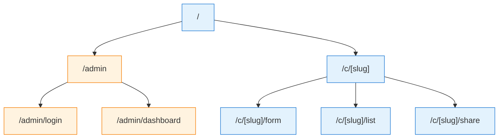

# S-05: 多社区路由系统

**Version**: 1.0
**Last Updated**: 2025-12-04
**Status**: ✅ Spec Complete

---

## Quick Reference

**Purpose**: 定义社区成员名录项目的多社区路由架构、链接生成策略和社区 slug 管理。

**Dependencies**:
- S-00: 系统架构概览
- S-03: 数据库设计

**Used By**:
- F-03: 社区管理
- F-04: 成员信息收集表单
- F-05: 分享内容生成
- F-06: 成员列表查看

---

## Dependencies

### Required System Modules
- [S-00: 系统架构概览](./S-00-architecture.md) - 了解系统整体架构
- [S-03: 数据库设计](./S-03-database-schema.md) - 了解 communities 表结构

### External Services
- **Next.js 14 App Router** - 文件系统路由
- **qrcode** - 二维码生成库（可选）

### Infrastructure Requirements
- Next.js 14 + React 18
- TypeScript

---

## 路由架构概览

### 多社区路由模式

本项目采用 **社区 Slug 路由** 模式，每个社区拥有独立的 URL 路径：

```
/c/[slug]/form      → 成员信息收集表单
/c/[slug]/list      → 成员列表查看
/c/[slug]/share     → 分享内容页面（可选）
```

### 路由层次结构



---

## Next.js 动态路由实现

### 文件系统结构

```
app/
├── page.tsx                          # 首页（可选）
├── admin/
│   ├── login/
│   │   └── page.tsx                  # 管理员登录页
│   └── dashboard/
│       └── page.tsx                  # 管理员后台
└── c/
    └── [slug]/
        ├── form/
        │   └── page.tsx              # 成员信息收集表单
        ├── list/
        │   └── page.tsx              # 成员列表查看
        └── share/
            └── page.tsx              # 分享内容页面（可选）
```

### 动态路由参数获取

**文件路径**: `app/c/[slug]/form/page.tsx`

```typescript
// app/c/[slug]/form/page.tsx
import { notFound } from 'next/navigation';
import { prisma } from '@/lib/prisma';

interface PageProps {
  params: Promise<{
    slug: string;
  }>;
}

export default async function CommunityFormPage({ params }: PageProps) {
  const { slug } = await params;

  // 1. 查询社区信息
  const community = await prisma.community.findUnique({
    where: { slug },
  });

  // 2. 社区不存在，返回 404
  if (!community) {
    notFound();
  }

  // 3. 渲染表单页面
  return (
    <div className="max-w-2xl mx-auto px-4 py-8">
      <h1 className="text-3xl font-bold text-gray-900 mb-2">
        {community.name} - 成员信息收集
      </h1>
      {community.description && (
        <p className="text-gray-600 mb-6">{community.description}</p>
      )}

      {/* 表单组件 */}
      <MemberForm communityId={community.id} />
    </div>
  );
}
```

### 路由示例

使用友好的 slug 作为路由参数的实际示例：

```
/c/pm-community/form      → 产品经理社区表单
/c/design-team/list       → 设计团队成员列表
/c/tech-club/share        → 技术俱乐部分享页面
```

**优势**:
- ✅ 短链接，适合微信分享
- ✅ 可读性强，易于记忆
- ✅ SEO 友好
- ✅ 专业美观

---

## 链接生成策略

### 链接类型

每个社区生成以下链接：

| 链接类型 | URL 模式 | 用途 |
|---------|---------|------|
| **表单链接** | `/c/[slug]/form` | 普通用户填写成员信息 |
| **成员列表** | `/c/[slug]/list` | 查看社区所有成员 |
| **分享内容** | `/c/[slug]/share` | 显示分享内容（可选） |

### 链接生成工具函数

**文件路径**: `lib/utils/links.ts`

```typescript
// lib/utils/links.ts

/**
 * 生成社区表单链接
 */
export function generateFormLink(slug: string): string {
  const baseUrl = process.env.NEXT_PUBLIC_APP_URL || 'http://localhost:3000';
  return `${baseUrl}/c/${slug}/form`;
}

/**
 * 生成社区成员列表链接
 */
export function generateMembersLink(slug: string): string {
  const baseUrl = process.env.NEXT_PUBLIC_APP_URL || 'http://localhost:3000';
  return `${baseUrl}/c/${slug}/list`;
}

/**
 * 生成社区分享内容链接
 */
export function generateShareLink(slug: string): string {
  const baseUrl = process.env.NEXT_PUBLIC_APP_URL || 'http://localhost:3000';
  return `${baseUrl}/c/${slug}/share`;
}

/**
 * 生成社区所有链接
 */
export interface CommunityLinks {
  formLink: string;
  membersLink: string;
  shareLink: string;
}

export function generateCommunityLinks(slug: string): CommunityLinks {
  return {
    formLink: generateFormLink(slug),
    membersLink: generateMembersLink(slug),
    shareLink: generateShareLink(slug),
  };
}
```

### 在管理后台显示链接

**文件路径**: `components/CommunityLinksCard.tsx`

```typescript
// components/CommunityLinksCard.tsx
'use client';

import { useState } from 'react';
import { generateCommunityLinks } from '@/lib/utils/links';

interface CommunityLinksCardProps {
  slug: string;
}

export default function CommunityLinksCard({ slug }: CommunityLinksCardProps) {
  const links = generateCommunityLinks(slug);
  const [copied, setCopied] = useState<string | null>(null);

  const handleCopy = async (text: string, type: string) => {
    try {
      await navigator.clipboard.writeText(text);
      setCopied(type);
      setTimeout(() => setCopied(null), 2000);
    } catch (error) {
      console.error('复制失败:', error);
    }
  };

  return (
    <div className="bg-white rounded-lg border border-gray-200 p-6">
      <h3 className="text-lg font-semibold text-gray-900 mb-4">
        社区链接
      </h3>

      <div className="space-y-3">
        {/* 表单链接 */}
        <div>
          <label className="block text-sm font-medium text-gray-700 mb-1">
            表单链接
          </label>
          <div className="flex items-center gap-2">
            <input
              type="text"
              value={links.formLink}
              readOnly
              className="flex-1 px-3 py-2 bg-gray-50 border border-gray-300 rounded-md text-sm text-gray-700"
            />
            <button
              onClick={() => handleCopy(links.formLink, 'form')}
              className="px-4 py-2 bg-blue-500 hover:bg-blue-600 text-white text-sm font-medium rounded-md transition-colors"
            >
              {copied === 'form' ? '已复制' : '复制'}
            </button>
          </div>
        </div>

        {/* 成员列表链接 */}
        <div>
          <label className="block text-sm font-medium text-gray-700 mb-1">
            成员列表链接
          </label>
          <div className="flex items-center gap-2">
            <input
              type="text"
              value={links.membersLink}
              readOnly
              className="flex-1 px-3 py-2 bg-gray-50 border border-gray-300 rounded-md text-sm text-gray-700"
            />
            <button
              onClick={() => handleCopy(links.membersLink, 'members')}
              className="px-4 py-2 bg-blue-500 hover:bg-blue-600 text-white text-sm font-medium rounded-md transition-colors"
            >
              {copied === 'members' ? '已复制' : '复制'}
            </button>
          </div>
        </div>
      </div>
    </div>
  );
}
```

---

## 社区 Slug 管理

### Slug 生成规则

Slug 是 URL 友好的唯一标识符，遵循以下规则：

1. **仅包含小写字母、数字和连字符**: `[a-z0-9-]`
2. **不能以连字符开头或结尾**: `^[a-z0-9]` 和 `[a-z0-9]$`
3. **长度限制**: 2-100 个字符
4. **唯一性**: 数据库唯一索引确保不重复

### Slug 生成工具函数

**文件路径**: `lib/utils/slug.ts`

```typescript
// lib/utils/slug.ts

/**
 * 将社区名称转换为 slug
 */
export function generateSlug(name: string): string {
  return name
    .toLowerCase()
    .trim()
    .replace(/[\s_]+/g, '-')        // 替换空格和下划线为连字符
    .replace(/[^\w\-]+/g, '')       // 移除非字母数字和连字符的字符
    .replace(/\-\-+/g, '-')         // 多个连字符替换为单个
    .replace(/^-+/, '')             // 移除开头的连字符
    .replace(/-+$/, '');            // 移除结尾的连字符
}

/**
 * 验证 slug 格式
 */
export function isValidSlug(slug: string): boolean {
  const slugRegex = /^[a-z0-9]+(?:-[a-z0-9]+)*$/;
  return slugRegex.test(slug) && slug.length >= 2 && slug.length <= 100;
}

/**
 * 生成唯一 slug（处理冲突）
 */
export async function generateUniqueSlug(
  name: string,
  prisma: any
): Promise<string> {
  let slug = generateSlug(name);
  let counter = 1;

  // 检查 slug 是否已存在
  while (true) {
    const existing = await prisma.community.findUnique({
      where: { slug },
    });

    if (!existing) {
      return slug;
    }

    // Slug 已存在，添加数字后缀
    slug = `${generateSlug(name)}-${counter}`;
    counter++;
  }
}
```

### 使用示例

**创建社区时自动生成 slug**:

```typescript
// app/api/communities/route.ts
import { generateUniqueSlug } from '@/lib/utils/slug';

export async function POST(request: Request) {
  const body = await request.json();
  const { name, description } = body;

  // 自动生成唯一 slug
  const slug = await generateUniqueSlug(name, prisma);

  const community = await prisma.community.create({
    data: {
      name,
      slug,
      description,
    },
  });

  return NextResponse.json({ community });
}
```

---

## 二维码生成（可选）

### 安装依赖

```bash
npm install qrcode
npm install -D @types/qrcode
```

### 二维码生成工具函数

**文件路径**: `lib/utils/qrcode.ts`

```typescript
// lib/utils/qrcode.ts
import QRCode from 'qrcode';

/**
 * 生成二维码（Data URL 格式）
 */
export async function generateQRCode(url: string): Promise<string> {
  try {
    const qrCodeDataUrl = await QRCode.toDataURL(url, {
      errorCorrectionLevel: 'M',
      type: 'image/png',
      width: 300,
      margin: 2,
    });
    return qrCodeDataUrl;
  } catch (error) {
    console.error('二维码生成失败:', error);
    throw new Error('二维码生成失败');
  }
}

/**
 * 生成社区链接的二维码
 */
export async function generateCommunityQRCodes(communityId: string) {
  const formLink = generateFormLink(communityId);
  const membersLink = generateMembersLink(communityId);

  const [formQR, membersQR] = await Promise.all([
    generateQRCode(formLink),
    generateQRCode(membersLink),
  ]);

  return {
    formQR,
    membersQR,
  };
}
```

### 二维码显示组件

**文件路径**: `components/CommunityQRCodes.tsx`

```typescript
// components/CommunityQRCodes.tsx
'use client';

import { useEffect, useState } from 'react';

interface CommunityQRCodesProps {
  communityId: string;
}

export default function CommunityQRCodes({ communityId }: CommunityQRCodesProps) {
  const [qrCodes, setQRCodes] = useState<{
    formQR: string | null;
    membersQR: string | null;
  }>({
    formQR: null,
    membersQR: null,
  });
  const [loading, setLoading] = useState(true);

  useEffect(() => {
    async function fetchQRCodes() {
      try {
        const response = await fetch(`/api/communities/${communityId}/qrcodes`);
        const data = await response.json();
        setQRCodes(data);
      } catch (error) {
        console.error('获取二维码失败:', error);
      } finally {
        setLoading(false);
      }
    }

    fetchQRCodes();
  }, [communityId]);

  if (loading) {
    return <div>加载中...</div>;
  }

  return (
    <div className="grid grid-cols-1 sm:grid-cols-2 gap-6">
      {/* 表单二维码 */}
      <div className="bg-white rounded-lg border border-gray-200 p-6 text-center">
        <h3 className="text-lg font-semibold text-gray-900 mb-4">
          表单二维码
        </h3>
        {qrCodes.formQR && (
          
        )}
        <p className="text-sm text-gray-500 mt-4">
          扫码填写成员信息
        </p>
      </div>

      {/* 成员列表二维码 */}
      <div className="bg-white rounded-lg border border-gray-200 p-6 text-center">
        <h3 className="text-lg font-semibold text-gray-900 mb-4">
          成员列表二维码
        </h3>
        {qrCodes.membersQR && (
          
        )}
        <p className="text-sm text-gray-500 mt-4">
          扫码查看成员列表
        </p>
      </div>
    </div>
  );
}
```

### 二维码 API

**文件路径**: `app/api/communities/[communityId]/qrcodes/route.ts`

```typescript
// app/api/communities/[communityId]/qrcodes/route.ts
import { NextRequest, NextResponse } from 'next/server';
import { generateCommunityQRCodes } from '@/lib/utils/qrcode';

export async function GET(
  request: NextRequest,
  { params }: { params: Promise<{ communityId: string }> }
) {
  try {
    const { communityId } = await params;

    const qrCodes = await generateCommunityQRCodes(communityId);

    return NextResponse.json(qrCodes);
  } catch (error) {
    console.error('生成二维码失败:', error);
    return NextResponse.json(
      { error: '生成二维码失败' },
      { status: 500 }
    );
  }
}
```

---

## 路由优化

### 静态生成 vs 动态渲染

**静态生成**（适合社区数量少且稳定的情况）:

```typescript
// app/c/[slug]/list/page.tsx

// 预生成所有社区的成员列表页面
export async function generateStaticParams() {
  const communities = await prisma.community.findMany({
    select: { slug: true },
  });

  return communities.map((community) => ({
    slug: community.slug,
  }));
}

export default async function MembersPage({ params }: PageProps) {
  // 静态生成的页面
  // ...
}
```

**动态渲染**（推荐，适合社区频繁创建）:

```typescript
// app/c/[slug]/list/page.tsx

// 使用动态渲染
export const dynamic = 'force-dynamic';

export default async function MembersPage({ params }: PageProps) {
  // 每次请求时动态渲染
  // ...
}
```

### ISR（增量静态再生）

结合静态生成和动态渲染的优点：

```typescript
// app/c/[slug]/list/page.tsx

// 启用 ISR，每 60 秒重新验证
export const revalidate = 60;

export default async function MembersPage({ params }: PageProps) {
  // 首次访问时静态生成，60 秒后重新验证
  // ...
}
```

---

## 错误处理

### 404 页面（社区不存在）

**文件路径**: `app/c/[slug]/not-found.tsx`

```typescript
// app/c/[slug]/not-found.tsx
export default function NotFound() {
  return (
    <div className="min-h-screen flex items-center justify-center px-4">
      <div className="text-center">
        <h1 className="text-4xl font-bold text-gray-900 mb-4">
          社区不存在
        </h1>
        <p className="text-gray-600 mb-6">
          您访问的社区可能已被删除或不存在。
        </p>
        <a
          href="/"
          className="inline-block px-6 py-3 bg-blue-500 hover:bg-blue-600 text-white font-semibold rounded-md transition-colors"
        >
          返回首页
        </a>
      </div>
    </div>
  );
}
```

### 使用 notFound()

在页面组件中调用 `notFound()`:

```typescript
import { notFound } from 'next/navigation';

export default async function Page({ params }: PageProps) {
  const community = await prisma.community.findUnique({
    where: { slug: params.slug },
  });

  if (!community) {
    notFound(); // 显示 not-found.tsx
  }

  // ...
}
```

---

## Related Documents

### 系统设计模块
- [S-00: 系统架构概览](./S-00-architecture.md)
- [S-03: 数据库设计](./S-03-database-schema.md)

### 功能模块
- [F-03: 社区管理](../features/F-03-community-management.md) - 创建社区和生成链接
- [F-04: 成员信息收集表单](../features/F-04-member-form.md) - 使用动态路由
- [F-06: 成员列表查看](../features/F-06-member-list.md) - 使用动态路由

---

## Notes

### 路由策略选择

**方案 1: 使用社区 ID**
- ✅ 实现简单，无需额外逻辑
- ✅ URL 唯一性由数据库保证
- ❌ URL 不友好（UUID 太长）

**方案 2: 使用社区 Slug**
- ✅ URL 友好（如 `/c/pm-community/form`）
- ✅ SEO 优化更好
- ❌ 需要处理 slug 冲突
- ❌ 需要额外索引查询

**✅ 采用方案**: 使用社区 Slug（方案 2）
- 用户分享链接统一使用 `/c/[slug]/...` 格式
- 管理API使用ID进行操作（避免slug冲突）
- 短链接、可读性强、便于分享

### 环境变量配置

**开发环境** (`.env.local`):
```env
NEXT_PUBLIC_APP_URL="http://localhost:3000"
```

**生产环境** (Vercel):
```env
NEXT_PUBLIC_APP_URL="https://yourdomain.com"
```

### 微信分享优化

微信分享链接时会抓取页面的 Open Graph 标签，需要在页面中添加：

```typescript
// app/c/[slug]/list/page.tsx
import { Metadata } from 'next';

export async function generateMetadata({ params }: PageProps): Promise<Metadata> {
  const { slug } = await params;
  const community = await prisma.community.findUnique({
    where: { slug },
  });

  if (!community) {
    return {};
  }

  return {
    title: `${community.name} - 成员列表`,
    description: community.description || `查看 ${community.name} 的所有成员`,
    openGraph: {
      title: `${community.name} - 成员列表`,
      description: community.description || `查看 ${community.name} 的所有成员`,
      url: `/c/${slug}/list`,
    },
  };
}
```
